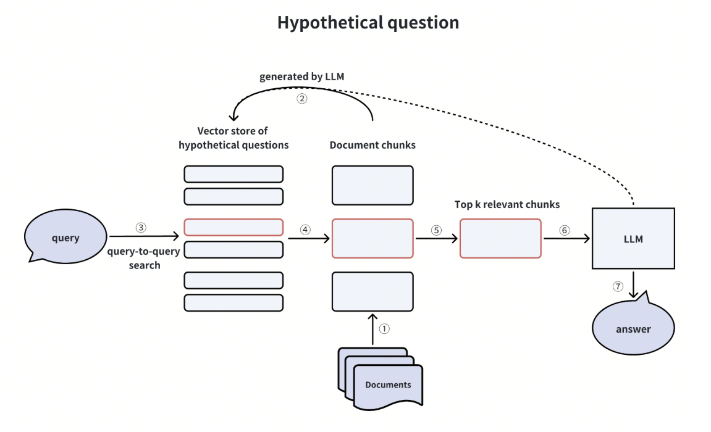
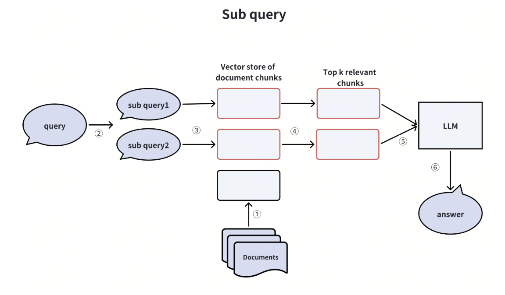
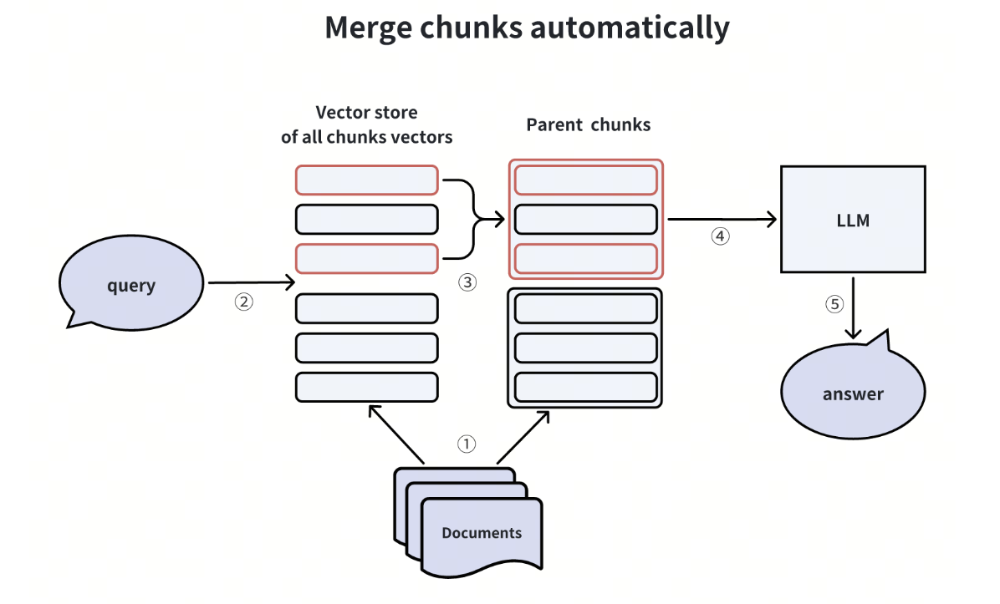
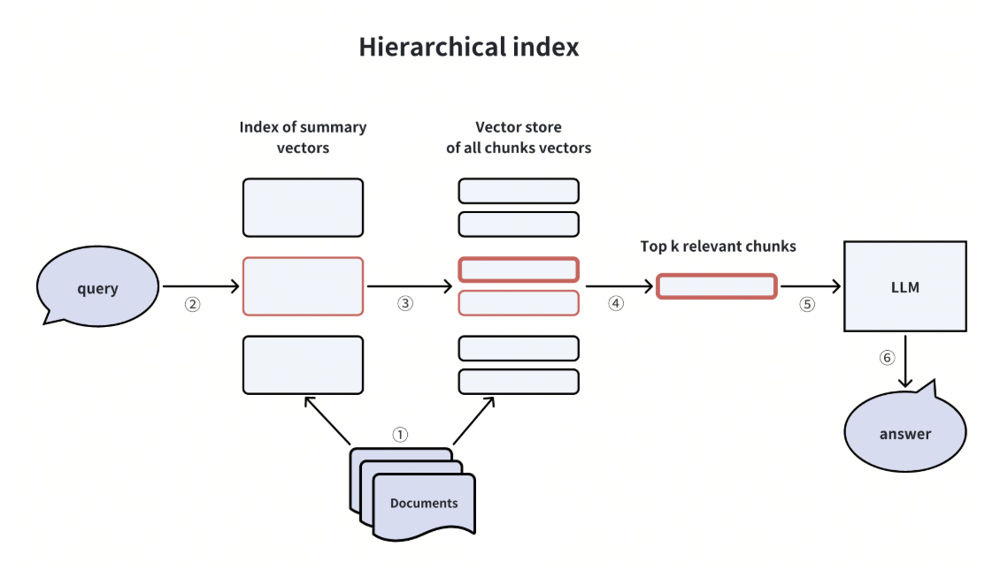
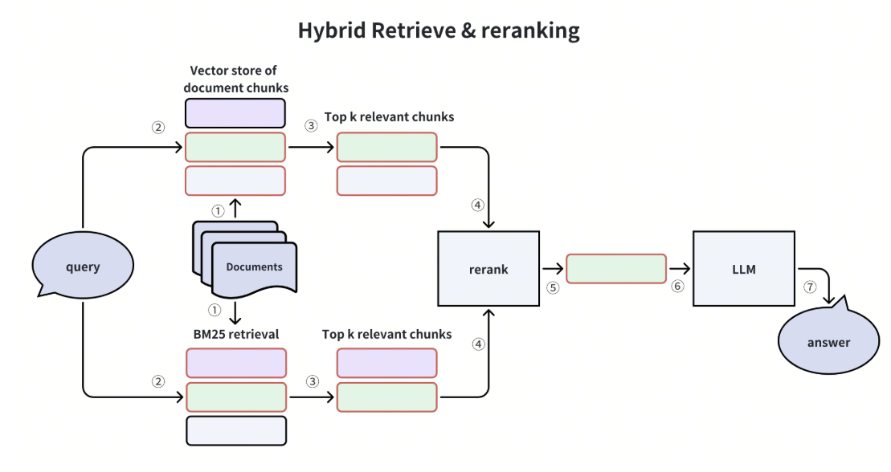
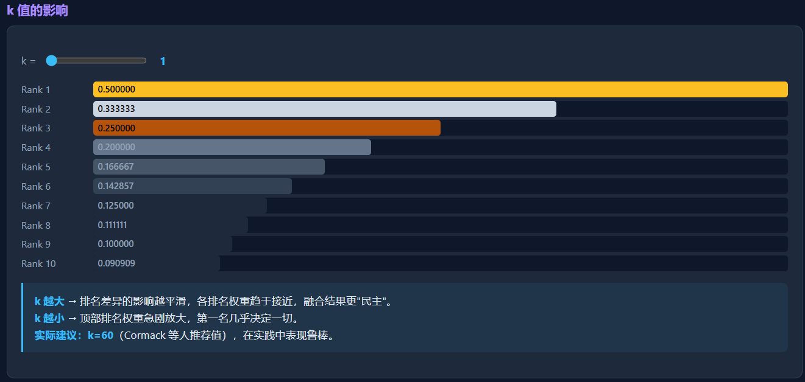
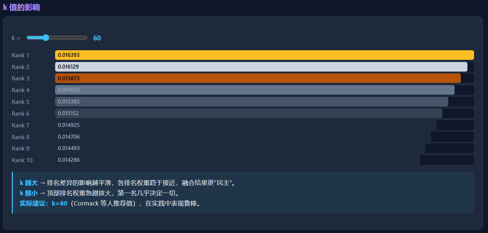
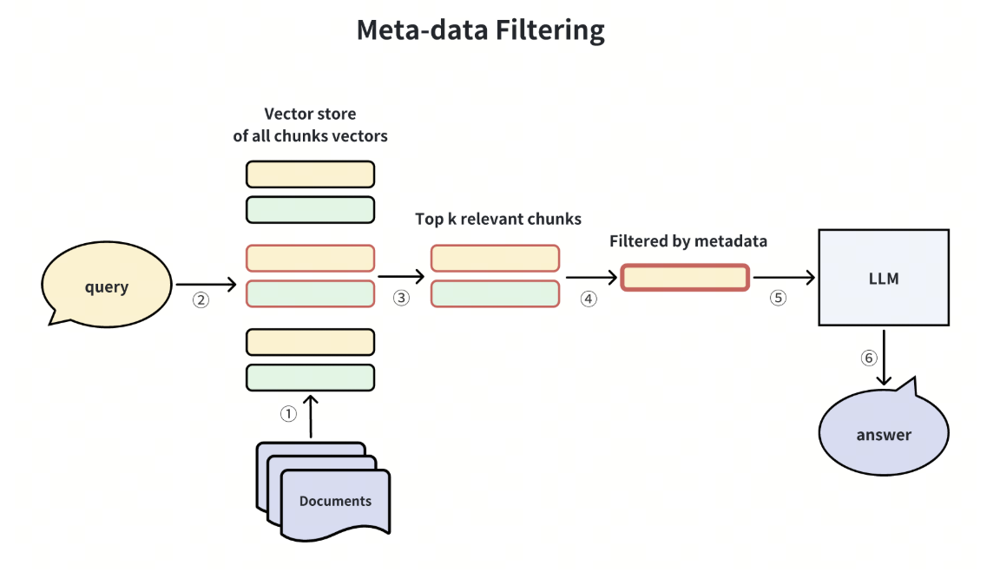
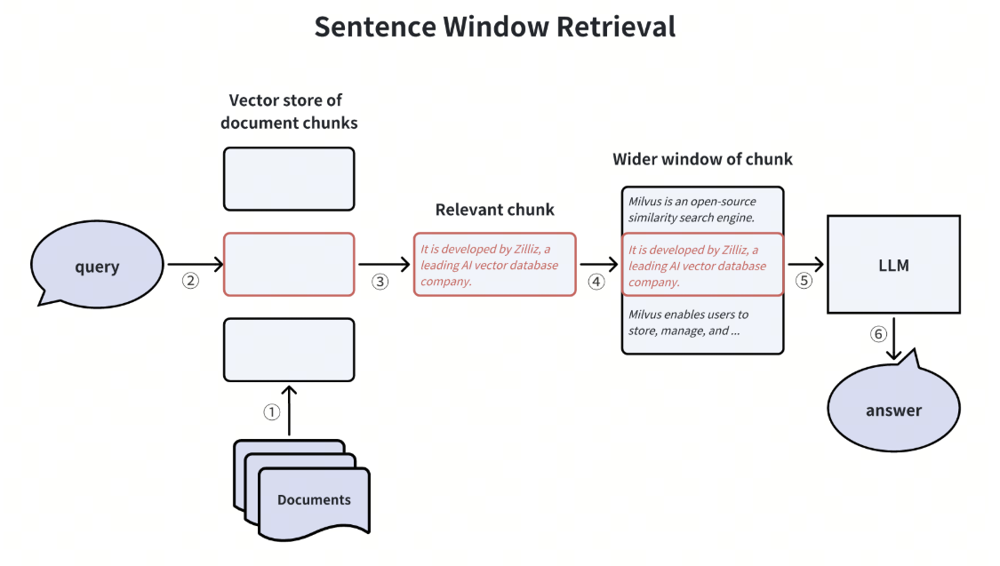
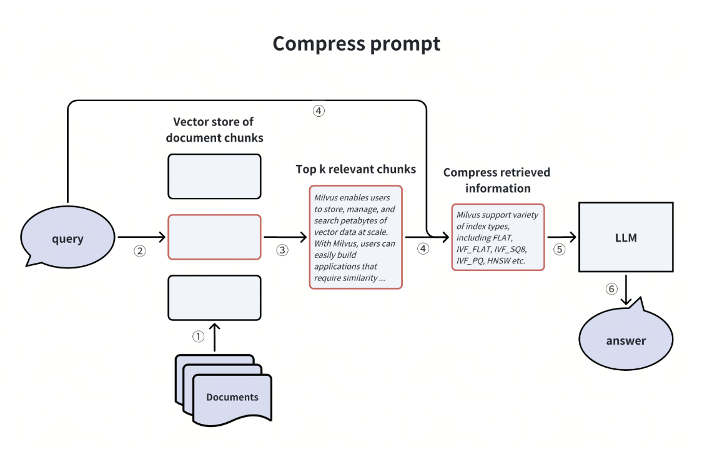

# Milvus《如何提高 RAG pipeline的性能》学习笔记

https://milvus.io/docs/zh/how_to_enhance_your_rag.md

## 先理解：标准 RAG 的问题

最基础的 RAG 可以写成：

$$
q \rightarrow Embedding(q) \rightarrow Retriever \rightarrow TopK(D) \rightarrow LLM(q,D) \rightarrow Answer
$$


也就是：

```
用户问题
   ↓
Embedding
   ↓
向量数据库retrive一下
   ↓
Top-K Chunk
   ↓
Prompt
   ↓
LLM
   ↓
Answer
```

这是最典型的 **Naive RAG**。RAG 最早的代表性工作是 Lewis 等人的 *Retrieval-Augmented Generation for Knowledge-Intensive NLP Tasks*，核心思想就是把模型参数中的“parametric memory”和外部检索到的“non-parametric memory”结合起来。([arXiv](https://arxiv.org/abs/2005.11401?utm_source=chatgpt.com))

问题在于：

$$
\boxed{\text{最终回答质量} \neq \text{只取决于 LLM}}
$$


更接近：

$$
Quality = f(Query, Chunk, Index, Retriever, Reranker, Context, Generator)
$$


例如用户问：

> “Milvus 和 Elasticsearch 在十亿级向量检索场景下有什么区别？”

直接 embedding 这个问题，可能出现：

- Query 本身表达不适合检索；
- 一个 query 同时包含多个子问题；
- Chunk 切得不好；
- Dense retrieval 没找到关键词；
- Top-K 里面有很多噪声；
- 真正重要的信息被放在上下文中间；
- 检索结果本身就是错的；
- 其实需要二次检索。

所以 Advanced RAG 开始从整个 pipeline 动手。

Milvus 把这些优化概括为五大类：**查询增强、索引增强、检索器增强、生成器增强、整个 RAG pipeline 增强。** 

---

## 五大模块总览

这篇教程可以按 RAG pipeline 的五个阶段来理解：

| 模块 | 核心问题 | 代表方法 |
| --- | --- | --- |
| **1. 查询增强** | 查什么？如何把用户问题变成更适合检索的表达？ | Hypothetical Questions、HyDE、Query Decomposition、Step-Back、Query2doc |
| **2. 索引增强** | 文档怎么切、怎么组织、怎么存？ | Auto-Merging、Hierarchical Index |
| **3. 检索器增强** | 怎么召回、融合、过滤和重排？ | Dense + BM25、SPLADE、RRF、Reranker、Metadata Filtering |
| **4. 生成器增强** | 检索结果怎么组织给 LLM，才能让它更好利用？ | Sentence Window、Context Compression、Context Reordering |
| **5. Pipeline 增强** | 什么时候检索、失败后怎么办、是否需要其他工具？ | Self-RAG、CRAG、Routing、Retry、Agentic RAG |

可以把主线记成：

$$
Query \rightarrow Index \rightarrow Retriever \rightarrow Generator \rightarrow Adaptive\ Pipeline
$$

---

## 模块一：查询增强（Query Enhancement）——先把“问题”改造成适合搜索的问题

很多时候不是数据库检索能力差，而是：

> **用户问题 ≠ 最适合 Retriever 的检索表达。**

于是有：

```
User Query
     ↓
Query Transformation
     ↓
Retrieval Query
     ↓
Retriever
```

Milvus 介绍了四种典型方案。

---

### 1.1 Hypothetical Questions：给文档预先生成“可能的问题”



假设原始 Chunk内容如下：

> Milvus supports distributed vector similarity search and can scale horizontally...

传统方法存：

```
chunk → embedding → vector DB
```

而 Hypothetical Question 方法先让 LLM 给这个 chunk 生成：

```
Q1: Milvus 是否支持分布式部署？
Q2: Milvus 如何进行水平扩展？
Q3: Milvus 能否进行大规模向量检索？
```

然后存：

```
question embedding → original chunk
```

用户真正问：

> Milvus 能横向扩展吗？

这时变成：

$$
Question_{user} \leftrightarrow Question_{generated}
$$


而不是：

$$
Question \leftrightarrow Document
$$


Milvus 把它解释为缓解 **query-document asymmetric problem**：查询通常很短，而文档是陈述句且比较长，二者在表示空间中天然存在形式差异。

#### 优点

特别适合：

- FAQ；
- 产品手册；
- API 文档；
- 知识库 QA。

#### 缺点

离线成本增加：

```
100 万 chunks
× 每 chunk 5 个 question
= 500 万 question embeddings
```

数据库规模直接上去了。

---

### 1.2 HyDE：先“编一个答案”，再拿它去搜索

论文：

**Gao et al., Precise Zero-Shot Dense Retrieval without Relevance Labels (HyDE)**。

HyDE =

> **Hypothetical Document Embeddings**

普通 Retrieval：

$$
q \xrightarrow{Encoder} e_q \xrightarrow{ANN} Documents
$$


HyDE：

$$
q \xrightarrow{LLM} \hat d \xrightarrow{Encoder} e_{\hat d} \xrightarrow{ANN} Documents
$$


即：

```
问题
 ↓
LLM
 ↓
生成一个“假想答案”
 ↓
Embedding
 ↓
用假答案搜索真正文档
```

例如：

> Q：Transformer 为什么需要 position encoding？

LLM 先凭参数知识生成：

> Transformer's self-attention operation itself is permutation invariant, therefore positional information...

然后：

```
embedding(假答案)
```

再拿这个 embedding 搜论文/教材。

#### 为什么有效？

因为 embedding 检索真正希望找到的是：

$$
Document \leftrightarrow Document
$$


而不是：

$$
Question \leftrightarrow Document
$$


也就是把：

```
短 Query
vs
长 Document
```

转换成：

```
Hypothetical Document
vs
Real Document
```

作者的核心观点也是：假想文档即使包含错误细节，其 embedding 仍可能把检索引向正确语义区域，再由真实 corpus 对它进行 grounding。

---

### 1.3 Query Decomposition：复杂问题拆成子问题



例如：

> “Milvus 和 Elasticsearch 在架构、向量检索性能、扩展性上有什么区别？”

这是一个典型 multi-aspect query。

不要直接：

```
一个 Query
    ↓
一次检索
```

而是：

```
原问题
   ↓
LLM decomposition
   ├── Milvus 架构是什么？
   ├── Elasticsearch 架构是什么？
   ├── 两者如何进行向量检索？
   └── 两者扩展性如何？
       ↓
     分别检索
       ↓
   evidence aggregation
```

Milvus 也将这一方法称为 **创建子查询**：对于知识库里未必存在“一块文档直接回答整个问题”的复杂 Query，通过拆解可以分别找到证据。([Milvus](https://milvus.io/docs/zh/how_to_enhance_your_rag.md))

它实际上已经从普通 RAG 开始走向：

> **Multi-hop RAG / Agentic RAG**

因为系统不再是：

```
retrieve once → answer
```

而是：

```
plan
→ retrieve
→ retrieve
→ aggregate
→ answer
```

---

### 1.4 Step-Back Prompting：不要搜问题本身，先搜它背后的原理

Milvus 把这个叫创建“回溯问题”。

原问题：

> “我的数据有 100 亿条，可以放进 Milvus 吗？”

可以改写成：

> “Milvus 的数据规模和水平扩展能力是什么？”

也就是：

$$
Specific\ Question \rightarrow Abstract\ Question
$$

这和 Google DeepMind 提出的 **Step-Back Prompting** 思路高度一致。

论文：

**Take a Step Back: Evoking Reasoning via Abstraction in Large Language Models**。作者让模型从具体实例退回到更高层概念和第一性原理，再利用这些知识解决具体问题。([arXiv](https://arxiv.org/abs/2310.06117?utm_source=chatgpt.com))

例如：

```
原问题：
为什么 Adam 通常比 SGD 更容易训练 Transformer？
​
Step-back：
自适应学习率优化器和固定学习率优化器有什么本质区别？
```

先检索 general principle，再回答具体问题。

---

### 1.5 Query Enhancement 总结

可以把这一部分压缩成：

| 方法 | 核心思想 | 解决的问题 |
| --- | --- | --- |
| Hypothetical Questions | 文档 → 可能的问题            | Query / Document 不对称   |
| HyDE                   | Query → 假想文档          | Query / Document 不对称   |
| Sub-query              | 一个复杂 Query → 多个 Query | Multi-hop / comparison |
| Step-back              | 具体 Query → 抽象 Query   | 太具体、缺背景知识              |

其中还有一个非常值得补充、Milvus 这页没重点展开的方法：

### 1.6 Query2doc：用 LLM 做查询扩展

*Query2doc: Query Expansion with Large Language Models* 会让 LLM 生成 pseudo-document，再用它扩展 Query；论文报告这种方法既能改善 BM25，也能改善 dense retriever。([arXiv](https://arxiv.org/abs/2303.07678?utm_source=chatgpt.com))

所以可以把 Query Transformation 看成一个更大的家族：

```
               Query Transformation
                      │
        ┌─────────────┼─────────────┐
        ↓             ↓             ↓
      Rewrite      Expansion    Decomposition
        ↓             ↓             ↓
     Step-back       HyDE       Sub-query
                     Query2doc
```

---

## 模块二：索引增强（Index Enhancement）——文档怎么组织和存储

第二层是：

> **Indexing 阶段。**

最 naive 的方法：

```
Document
 ↓
固定长度切块
 ↓
Chunk
 ↓
Embedding
```

例如：

```
512 tokens
512 tokens
512 tokens
512 tokens
```

最大的问题：

> **最适合检索的 chunk 粒度，不一定是最适合 LLM 阅读的 chunk 粒度。**

这是 Advanced RAG 一个非常重要的思想。

---

### 2.1 Auto-Merging：小块负责“搜”，大块负责“读”

Milvus 描述的是一种父子 Chunk 结构。([Milvus](https://milvus.io/docs/zh/how_to_enhance_your_rag.md))



例如：

```
                Parent Chunk
              1500 tokens
            /      |       \
         C1       C2        C3
       300t      300t      300t
```

检索：

```
Query
 ↓
检索小 Chunk
 ↓
C1、C2、C3 都命中
 ↓
发现属于同一个 Parent
 ↓
Merge
 ↓
把 Parent 给 LLM
```

这非常聪明。

因为：

#### Retrieval 希望

Chunk 越小：

$$
Semantic\ Specificity \uparrow
$$

容易精准匹配。

#### Generation 希望

Chunk 越大：

$$
Context\ Completeness \uparrow
$$

上下文完整。

所以：

$$
\boxed{ Retrieval\ Granularity \neq Generation\ Granularity }
$$

Auto-Merging 就是在解决这个矛盾。

---

### 2.2 Hierarchical Index：先根据文档摘要选择文档，再找文档内部的Chunk



假设知识库：

```
10000 篇论文
每篇论文 100 chunks
= 100 万 chunks
```

Naive：

```
query
 ↓
100 万 chunks 中直接 search
```

Hierarchical：

```
query
 ↓
Document Summary Index
 ↓
找到相关论文
 ↓
Chunk Index
 ↓
只在相关论文里找 chunk
```

即：

$$
Query \rightarrow Document \rightarrow Section \rightarrow Chunk
$$

Milvus 的教程就是用“文档摘要一级索引 + chunk 二级索引”来解释这种方法。([Milvus](https://milvus.io/docs/zh/how_to_enhance_your_rag.md))

这个思想其实很像数据库：

```
先 pruning
再 fine-grained search
```

---

## 模块三：检索器增强（Retriever Enhancement）——召回、融合、过滤与重排

### 3.1 Hybrid Retrieval：Dense 不够，Sparse 来凑



这应该是工程 RAG 里最重要的 enhancement 之一。

传统：

$$
Dense Retrieval
$$

升级：

$$
Dense + Sparse
$$

例如：

```
                Query
               /     \
              ↓       ↓
          Dense      BM25
             \       /
              \     /
                RRF
                 ↓
               Top-K
```

Milvus 明确列举了：

- Dense Vector Search；
- BM25；
- SPLADE；
- RRF；
- Cross-Encoder reranking。([Milvus](https://milvus.io/docs/zh/how_to_enhance_your_rag.md))

---

### 3.2 BM25 和 Dense 为什么互补？

Dense 擅长语义：

```
Query:
大模型如何减少显存占用？
​
Document:
techniques for reducing LLM memory footprint
```

文字不一样，但语义一样。

Dense 很强。

但是：

```
CUDA error 802
milvus.exceptions.MilvusException
RFC 7231
```

这种：

- 型号；
- API；
- Error code；
- 人名；
- 专有名词；

BM25 往往非常重要。

因此：

$$
Dense = semantic matching
$$

$$
Sparse = lexical matching
$$

组合通常比单一路线鲁棒。

---

### 3.3 SPLADE：Sparse Retrieval 也可以是神经网络

不要形成：

```
Sparse = BM25
Dense = Neural
```

这种错误印象。

SPLADE 就是：

> **Learned Sparse Retrieval**

论文：

**SPLADE: Sparse Lexical and Expansion Model for First Stage Ranking**。它学习稀疏的词汇空间表示，同时保留倒排索引一类 sparse representation 的优势。([arXiv](https://arxiv.org/abs/2107.05720?utm_source=chatgpt.com))

所以可以画：

```
Retrieval
│
├── Sparse
│    ├── BM25
│    └── SPLADE
│
└── Dense
     ├── DPR
     ├── BGE
     ├── E5
     └── ...
```

---

### 3.4 RRF：Hybrid Retrieval 怎么合并？

假如 Dense：

```
D1
D3
D5
D7
```

BM25：

```
D3
D2
D1
D8
```

不能直接比较：

```
cosine_score = 0.82
BM25_score = 14.7
```

因为分数空间完全不同。

于是 RRF：

$$
RRF(d) = \sum_r \frac{1}{k + \operatorname{rank}_r(d)}
$$

它根本不在乎原始 score。

只看：

> **你在每个 Retriever 里排第几。**

例如 D3：

```
Dense rank = 2
BM25 rank = 1
```

所以：

$$
score(D3) = \frac{1}{k+2} + \frac{1}{k+1}
$$


RRF 是很经典的 rank fusion 方法，原始工作来自 Cormack、Clarke 和 Büttcher。([ACM数字图书馆](https://dl.acm.org/doi/10.1145/1571941.1572114?utm_source=chatgpt.com))

**K值对RRF结果的影响：**



K越小，意味着获得一个顶部排名的权重会非常大



K越大，意味着获得一个顶部排名的权重会变小

### 3.5 Reranker：Recall 和 Precision 分工

这是非常重要的一层设计。

Retriever 的目标：

> **不要漏。**

Reranker 的目标：

> **别把垃圾送给 LLM。**

因此：

```
100 万 chunks
     ↓
Retriever
     ↓
Top 50
     ↓
Reranker
     ↓
Top 5
     ↓
LLM
```

为什么不能直接 Cross-Encoder 搜 100 万条？

因为 Cross-Encoder 通常需要：

$$
f(query, document)
$$

对 query-document pair 做联合编码，计算贵。

Dense Retriever 可以：

```
document embedding
```

提前算好。

这也是现代 IR 很典型的：

$$
Recall \rightarrow Rerank
$$

架构。

ColBERT 则走了一个中间路线：通过 late interaction 保留 token-level 的细粒度匹配能力，同时让文档表示可以预计算。([arXiv](https://arxiv.org/abs/2004.12832?utm_source=chatgpt.com))

---

### 3.6 Metadata Filtering（元数据过滤）：很多问题根本不应该靠向量相似度解决



例如用户问：

> 2025 年苹果公司的财务报告中……

如果 vector retrieval 搜出：

```
2022
2023
2024
2025
```

你再希望 LLM 自己判断，非常浪费。

应该：

```
metadata:
company = Apple
year = 2025
type = annual_report
```

先过滤：

$$
D' = \{d \mid year = 2025\}
$$

再：

$$
VectorSearch(q,D')
$$

Milvus 也把年份、类别等 metadata filter 作为提高检索精确度的重要技术。([Milvus](https://milvus.io/docs/zh/how_to_enhance_your_rag.md))

一个很重要的工程原则：

> **能用结构化约束解决的问题，不要全部丢给 embedding。**

---

## 模块四：生成器增强（Generator Enhancement）——让 LLM 更好地使用证据

很多 RAG 系统会犯一个错误：

> Top-K 找对了，所以答案一定对。

不是。

Retriever：

```
Evidence Recall
```

Generator：

```
Evidence Utilization
```

是两个独立问题。

---

### 4.1 Sentence Window Retrieval：搜索小块，返回大窗口



和 Auto-Merging 很像，但实现逻辑不同。

假设文章：

```
S1
S2
S3
S4
S5
S6
S7
```

检索命中：

```
S4
```

真正给 LLM：

```
S2
S3
[S4]
S5
S6
```

即：

$$
RetrievalChunk = S_4
$$

但：

$$
GenerationContext = S_{2:6}
$$

Milvus 明确指出，这种做法把 **用于 embedding 的文本范围** 和 **最终提供给 LLM 的上下文范围** 分离开来。([Milvus](https://milvus.io/docs/zh/how_to_enhance_your_rag.md))

这和 Auto-Merging 的共同核心思想都是：

> **检索粒度和阅读粒度解耦。**

---

### 4.2 Context Compression（压缩上下文）：不是文档越多越好



假设 Retriever 返回：

```
Chunk1 1000 tokens
Chunk2 1000 tokens
Chunk3 1000 tokens
...
Chunk10
```

总共：

```
10000 tokens
```

真正和问题有关的：

```
800 tokens
```

那么可以：

```
retrieved chunks
      ↓
compressor
      ↓
relevant sentences
      ↓
LLM
```

本质：

$$
Context \rightarrow Relevant(Context,q)
$$

Milvus 将它称为压缩 LLM prompt，通过去除无关细节、强调关键段落来减少噪声和上下文长度。([Milvus](https://milvus.io/docs/zh/how_to_enhance_your_rag.md))

所以：

$$
More\ Context \not\Rightarrow Better\ Answer
$$

有时反而：

$$
Noise \uparrow \Rightarrow Accuracy \downarrow
$$

---

### 4.3 Lost in the Middle：上下文的位置也影响结果

非常值得读的一篇：

**Lost in the Middle: How Language Models Use Long Contexts**。([arXiv](https://arxiv.org/abs/2307.03172?utm_source=chatgpt.com))

研究发现：

> 当关键信息出现在长上下文开头或结尾时，LLM 往往表现较好；关键信息处在中间时性能可能显著下降。([arXiv](https://arxiv.org/abs/2307.03172?utm_source=chatgpt.com))

大概：

```
Attention / Utilization
​
高 ┐                 ┌ 高
   │\               /│
   │ \             / │
   │  \___________/  │
低 └─────────────────┘
​
 beginning      middle       end
```

所以 Milvus 提出：

```
高置信度 Chunk
低置信度
低置信度
高置信度 Chunk
```

让关键证据尽量出现在容易被模型利用的位置。([Milvus](https://milvus.io/docs/zh/how_to_enhance_your_rag.md))

这说明：

> **RAG 不只是“Retrieve What”，还包括“Present How”。**

---

## 模块五：Pipeline Enhancement——从固定流程走向自适应 RAG

前面这些仍然基本是：

```
固定 Pipeline
```

例如：

```
Rewrite
↓
Hybrid Search
↓
Rerank
↓
LLM
```

但一个更高级的问题出现了：

> 每个问题都需要这些步骤吗？

当然不是。

比如：

```
Q1：1+1 等于多少？
```

根本不需要 RAG。

```
Q2：我们的项目退款规则是什么？
```

需要 RAG。

```
Q3：比较 A、B 两份合同的差异
```

需要 multi-query。

```
Q4：这个知识库里没有，帮我查最新信息
```

可能需要 Web Search。

所以 pipeline 应该从：

$$
Static
$$

变成：

$$
Adaptive
$$

这就是 **Agentic RAG** 的入口。

---

### 5.1 Self-RAG：模型自己决定“要不要检索”

这篇建议认真读：

**Self-RAG: Learning to Retrieve, Generate, and Critique through Self-Reflection**。([arXiv](https://arxiv.org/abs/2310.11511?utm_source=chatgpt.com))

Naive RAG：

```
任何问题
 ↓
Retrieve Top-K
 ↓
Generate
```

Self-RAG：

```
Query
 ↓
需要 retrieval 吗？
 ├── No → Generate
 │
 └── Yes
      ↓
    Retrieve
      ↓
  Document relevant?
      ↓
    Generate
      ↓
 Answer supported?
```

它的核心创新之一，是训练模型生成特殊的 **reflection tokens**，使模型能够：

- 判断是否应该 retrieve；
- 判断 passage 是否 relevant；
- 判断 generation 是否有证据支持；
- 对结果进行 critique。([arXiv](https://arxiv.org/abs/2310.11511?utm_source=chatgpt.com))

所以 Self-RAG 最重要的不是：

> “多检索几次。”

而是：

> **Adaptive Retrieval + Self-Reflection。**

---

### 5.2 CRAG：检索错了怎么办？

这是另一个非常重要的思路。

论文：

**Corrective Retrieval Augmented Generation**。([arXiv](https://arxiv.org/abs/2401.15884?utm_source=chatgpt.com))

普通 RAG 最大的问题：

```
Retriever 错
   ↓
LLM 根据错误证据生成
   ↓
非常自信的错误答案
```

CRAG 加一个：

```
Retrieval Evaluator
```

流程：

```
Query
 ↓
Retrieve
 ↓
Evaluator
 ↓
检索质量怎么样？
 ├── Good
 │     ↓
 │   Generate
 │
 ├── Ambiguous
 │     ↓
 │ Additional retrieval
 │
 └── Bad
       ↓
    Corrective action
       ↓
      Web Search
```

原论文的核心就是设计一个轻量级 retrieval evaluator，对检索结果质量给出置信判断，并依据结果触发不同的知识获取动作；它还引入 web search 作为静态 corpus 的补充。([arXiv](https://arxiv.org/abs/2401.15884?utm_source=chatgpt.com))

所以：

$$
RAG \rightarrow Retrieve + Generate
$$

CRAG：

$$
Retrieve \rightarrow Evaluate \rightarrow Correct \rightarrow Generate
$$

---

### 5.3 Self-RAG 和 CRAG 的区别

这个很适合面试问。

| 对比维度 | Self-RAG | CRAG |
| --- | --- | --- |
| 核心               | 自我反思                           | 纠正错误检索                         |
| 是否需要检索           | 动态决定                           | 通常先检索                          |
| 谁判断              | LLM reflection                 | Retrieval evaluator            |
| 重点               | Retrieve / Generate / Critique | Retrieval quality              |
| 错误后              | Reflection / regenerate        | Web search 等 corrective action |

一句话：

> **Self-RAG 更关注“模型该不该检索、生成得对不对”；CRAG 更关注“Retriever 找到的东西靠谱吗，不靠谱怎么办”。**

---

### 5.4 Query Routing：真正进入 Agentic RAG

Milvus 最后一部分其实已经非常接近现代 Agentic RAG。

它明确提出可以增加 Router：

```
                 Query
                   ↓
                 Router
        ┌──────────┼──────────┐
        ↓          ↓          ↓
       LLM        RAG      Web Search
                   ↓
             Query Decompose?
                   ↓
               Retrieve
                   ↓
               Evaluate
              ↙         ↘
          sufficient    insufficient
             ↓              ↓
          answer        retrieve again
```

Router 可以是：

- LLM；
- 分类模型；
- Rules。

Milvus 也明确指出，路由不仅可以决定 **是否使用 RAG**，还可以决定：

- 是否 Web Search；
- 是否拆子问题；
- 是否搜索图片；
- 是否执行额外工具。([Milvus](https://milvus.io/docs/zh/how_to_enhance_your_rag.md))

这一步开始，系统已经不是简单 pipeline，而是：

$$
\boxed{State + Policy + Actions}
$$

---

## 五个模块的统一框架

读完之后，不建议背：

> HyDE、Auto-merging、BM25、Rerank、Self-RAG……

而是记下面这个图：

```
                         Advanced RAG
                              │
        ┌─────────────────────┼─────────────────────┐
        ↓                     ↓                     ↓
      Query                 Index               Retrieval
        │                     │                     │
   Query Rewrite         Chunk Strategy        Dense Search
   HyDE                  Parent-Child           BM25/SPLADE
   Sub-query             Hierarchical           Hybrid Search
   Step-back                                  Metadata Filter
                                                Rerank
        │
        └─────────────────────┬──────────────────────┐
                              ↓                      ↓
                         Generation              Pipeline
                              │                      │
                     Context Compression        Routing
                     Context Ordering           Reflection
                     Prompt Construction        Retry
                                               Web Search
                                               Agent
```

这才是这篇教程真正值得学的东西。

---

## 把整个 Advanced RAG 压缩成 5 个模块

### ① 查询增强：查什么？

$$
Query\ Transformation
$$

- Rewrite
- HyDE
- Sub-query / Query Decomposition
- Step-back
- Query2doc

### ② 索引增强：怎么存？

$$
Indexing
$$

- Chunking
- Parent-child / Auto-Merging
- Hierarchical Index

### ③ 检索器增强：怎么召回、融合与筛选？

$$
Retrieval \rightarrow Fusion \rightarrow Rerank
$$

- Dense Retrieval
- BM25 / SPLADE
- Hybrid Retrieval
- RRF
- Metadata Filtering
- Cross-Encoder / Reranker

### ④ 生成器增强：怎么把证据给 LLM？

$$
Context\ Construction \rightarrow Generation
$$

- Sentence Window Retrieval
- Context Compression
- Context Reordering
- Lost-in-the-Middle mitigation

### ⑤ Pipeline 增强：什么时候检索，检索错了怎么办？

$$
Adaptive\ RAG
$$

- Self-RAG
- CRAG
- Query Routing
- Retry / Additional Retrieval
- Web Search / Tool Use
- Agentic RAG

这五个模块对应一个很清晰的演进逻辑：**先优化每个静态环节，再让系统根据状态动态选择下一步动作。**

---
## 论文阅读路线

| 优先级 | 论文 | 要掌握什么 |
| --- | --- | --- |
| ⭐⭐⭐⭐⭐          | **Lewis et al., RAG (2020)**   | RAG 的原始范式                         |
| ⭐⭐⭐⭐⭐          | **HyDE (2022)**                | Query transformation              |
| ⭐⭐⭐⭐⭐          | **Lost in the Middle (2023)**  | 为什么 Context 构造重要                  |
| ⭐⭐⭐⭐⭐          | **Self-RAG (2023)**            | Adaptive retrieval / reflection   |
| ⭐⭐⭐⭐⭐          | **CRAG (2024)**                | Retrieval evaluation / correction |
| ⭐⭐⭐⭐           | **Step-Back Prompting (2023)** | Query abstraction                 |
| ⭐⭐⭐⭐           | **SPLADE (2021)**              | Learned sparse retrieval          |
| ⭐⭐⭐⭐           | **ColBERT (2020)**             | Late interaction retrieval        |
| ⭐⭐⭐            | **Query2doc (2023)**           | LLM query expansion               |
| ⭐⭐⭐            | **RRF (2009)**                 | Multi-retriever fusion            |

### ① RAG

Lewis et al.

**Retrieval-Augmented Generation for Knowledge-Intensive NLP Tasks**。([arXiv](https://arxiv.org/abs/2005.11401?utm_source=chatgpt.com))

---

### ② HyDE

Gao et al.

**Precise Zero-Shot Dense Retrieval without Relevance Labels**。([arXiv](https://arxiv.org/abs/2212.10496?utm_source=chatgpt.com))

记住：

$$
Query \rightarrow Hypothetical\ Document \rightarrow Embedding \rightarrow Retrieval
$$

---

### ③ Lost in the Middle

Liu et al.

**Lost in the Middle: How Language Models Use Long Contexts**。([arXiv](https://arxiv.org/abs/2307.03172?utm_source=chatgpt.com))

记住：

$$
Context\ Position \rightarrow Information\ Utilization
$$

---

### ④ Self-RAG

Asai et al.

**Self-RAG: Learning to Retrieve, Generate, and Critique through Self-Reflection**。([arXiv](https://arxiv.org/abs/2310.11511?utm_source=chatgpt.com))

记住：

$$
Retrieve? \rightarrow Retrieve \rightarrow Critique \rightarrow Generate \rightarrow Critique
$$

---

### ⑤ CRAG

Yan et al.

**Corrective Retrieval Augmented Generation**。([arXiv](https://arxiv.org/abs/2401.15884?utm_source=chatgpt.com))

记住：

$$
Retrieve \rightarrow Evaluate \rightarrow Correct
$$

