# 算法复习资料（acwing算法基础课难度+leetcode hot100）

> 基于算法上机模版整理，每章包含核心知识点与代码模板。

---

## 一、复杂度、递归与 C++ 基础

### 1.1 时间复杂度与空间复杂度

常见复杂度（从小到大）：

$$O(1) < O(\log n) < O(n) < O(n\log n) < O(n^2) < O(2^n) < O(n!)$$

**分析规则：**

- 只看最高阶项
- 循环折半 → $O(\log n)$
- 嵌套循环 → 乘积
- 递归 → 递归树 / 主定理

### 1.2 递归复杂度与主定理

对于 $T(n) = aT(n/b) + O(n^d)$：

- 若 $d < \log_b a$，则 $T(n) = O(n^{\log_b a})$
- 若 $d = \log_b a$，则 $T(n) = O(n^d \log n)$
- 若 $d > \log_b a$，则 $T(n) = O(n^d)$

**示例：归并排序**

```cpp
// T(n) = 2T(n/2) + O(n) → O(n log n)
void mergeSort(vector<int>& a, int l, int r) {
    if (l >= r) return;
    int mid = (l + r) / 2;
    mergeSort(a, l, mid);
    mergeSort(a, mid + 1, r);
    merge(a, l, mid, r);
}
```

### 1.3 STL 常用接口

| 容器类型                           | 放进去（插入/添加）                                            | 拿出来（移除/弹出）                             | 看一眼/查一下（访问/查找，不删除）                                                                               | 特殊（判空）    | 常用补充（大小/清空/注意）                                                                 |
| :----------------------------- | :---------------------------------------------------- | :------------------------------------- | :----------------------------------------------------------------------------------------------- | :-------- | :----------------------------------------------------------------------------- |
| **动态数组** `vector`              | `push_back`（尾插） `insert`（指定位置） `emplace_back`（C++11）  | `pop_back`（尾删，无返回值） `erase`（指定位置/范围）   | `operator[]`（无边界检查） `at()`（有边界检查，抛异常） `front` / `back`                                           | `empty()` | `size()` / `capacity()` / `clear()` **注**：`pop_back` 不返回元素，需先 `back()` 再 `pop` |
| **双端队列** `deque`               | `push_back`（尾插） `push_front`（头插） `insert`（指定位置）       | `pop_back`（尾删） `pop_front`（头删） `erase` | `operator[]` / `at()` `front` / `back`                                                           | `empty()` | `size()` / `clear()` **注**：支持随机访问，但底层非连续存储                                     |
| **双向链表** `list`                | `push_back` / `push_front` `insert`（指定位置）             | `pop_back` / `pop_front` `erase`       | `front` / `back` **（不支持 `[]` 和 `at()`）**                                                         | `empty()` | `size()` / `clear()` `splice`（拼接）、`remove`（按值删） **注**：插入删除不引起迭代器失效（除被删元素）      |
| **栈** `stack`（适配器）             | `push`（入栈）                                            | `pop`（出栈，**无返回值**）                     | `top`（访问栈顶）                                                                                      | `empty()` | `size()` **注**：默认基于 `deque`，无迭代器                                               |
| **队列** `queue`（适配器）            | `push`（入队）                                            | `pop`（出队，**无返回值**）                     | `front`（队首） `back`（队尾）                                                                           | `empty()` | `size()` **注**：默认基于 `deque`，无迭代器                                               |
| **优先队列** `priority_queue`（适配器） | `push`（插入）                                            | `pop`（弹出堆顶，**无返回值**）                   | `top`（访问堆顶最大值/最小值）                                                                               | `empty()` | `size()` **注**：默认基于 `vector`，无 `front/back`，默认是大根堆                             |
| **有序集合** `set` / `multiset`    | `insert`（插入） `emplace`                                | `erase`（按值/按迭代器）                       | `find`（返回迭代器） `count`（`set`返回0/1，`multiset`返回个数） `lower_bound` / `upper_bound`                   | `empty()` | `size()` / `clear()` **注**：红黑树实现，自动排序；`multiset` 允许重复键                         |
| **有序字典** `map` / `multimap`    | `insert`（插入 pair） `emplace` `map` 还支持 `[key] = value` | `erase`（按键/按迭代器）                       | `find` / `count` `map` 支持 `operator[]`（**会插入默认值**）和 `at()`（只读，抛异常） `lower_bound` / `upper_bound` | `empty()` | `size()` / `clear()` **注**：红黑树实现，按键排序；`multimap` 允许重复键且 **不支持 `[]` 和 `at()`**  |
| **哈希集合** `unordered_set`       | `insert` / `emplace`                                  | `erase`                                | `find`（返回迭代器） `count`（返回0/1，因为无重复）                                                               | `empty()` | `size()` / `clear()` / `reserve()` **注**：哈希表实现，无序，平均 O(1)                      |
| **哈希字典** `unordered_map`       | `insert` / `emplace` `[key] = value`（会覆盖或插入）          | `erase`（按键/按迭代器）                       | `find` / `count`（返回 bool） `operator[]`（**若键不存在则插入默认值，慎用于只读**） `at()`（只读，键不存在抛异常）                 | `empty()` | `size()` / `clear()` / `reserve()` **注**：哈希表实现，无序，平均 O(1)                      |

**string**

```cpp
string s = "hello"; 
s.substr(0, 3); 
s.substr(l,r-l+1)//如果有两个指针l+r，要截取[l...r]的字符串
s.find("el"); 
s += 'a' 
s += " world";//追加字符和追加字符串都一样，都能加上的
```

**sort 基础用法**

```cpp
sort(v.begin(), v.end());                    // 升序
sort(v.begin(), v.end(), greater<int>());    // 降序
//sort排序后不保证相等元素的原有相对顺序。
stable_sort(v.begin(), v.end());  //这才是稳定排序：相等元素保持原相对顺序
```

**pair 的默认排序**

```cpp
vector<pair<int, int>> vp = {{2, 3}, {1, 5}, {2, 1}};
sort(vp.begin(), vp.end());
// 结果：{1, 5}, {2, 1}, {2, 3}
```

`pair` 使用字典序比较：先比较 `first`，只有 `first` 相等时才比较 `second`。因此默认规则是“`first` 升序，`second` 升序”。

**自定义比较器 cmp**

比较器 `cmp(a, b)` 的含义是：如果 `a` 应该排在 `b` 前面，就返回 `true`。比较器必须满足严格弱序，尤其不能写成 `a <= b`；相等时应返回 `false`。

```cpp
bool cmp(pair<int, int>& a, pair<int, int>& b) {
    if (a.first != b.first) return a.first < b.first;  // first 升序
    return a.second < b.second;                         // second升序
}

sort(vp.begin(), vp.end(), cmp);
```

### 1.4 高级排序方法

**lambda 排序法**

lambda 适合只使用一次的排序规则，代码最短，也是竞赛中最常用的写法。

```cpp
sort(v.begin(), v.end(), [](int a, int b) {
    return a > b;  // 降序：a 应排在 b 前面
});
```

如果需要修改第二关键字的顺序，就要提供自定义比较器。例如“`first` 升序，`second` 降序”：

```cpp
sort(vp.begin(), vp.end(), [](pair<int, int>& a,pair<int, int>& b) {
    if (a.first != b.first) return a.first < b.first;
    return a.second > b.second;
});
```

**结构体重载 operator<**
如果一种类型需要反复使用同一套默认排序规则，可以在结构体中重载 `operator<`。下面按 `x` 升序排序；如果 `x` 相等，再按 `y` 升序排序。
```cpp
struct Node {
    int x, y;

    bool operator<(const Node& other) const {
        if (x != other.x) return x < other.x;
        return y < other.y;
    }
};

vector<Node> nodes;
sort(nodes.begin(), nodes.end());
```

如果只想临时改变规则，优先使用 `sort` 的第三个参数，而不是修改结构体的默认顺序。

**其他常用排序算法**
```cpp
nth_element(v.begin(), v.begin() + k, v.end());
// v[k] 到达排序后应在的位置；左侧不大于它，右侧不小于它，但两侧内部不保证有序
```
### 1.5 整数溢出与边界防护

```cpp
// 使用 long long
long long ans = 1LL * a * b;

// 取模防止溢出
const int MOD = 1e9 + 7;
ans = (ans + x) % MOD;
ans = (ans * x) % MOD;

// 二分取中防溢出
int mid = l + (r - l) / 2;

// INT_MAX / INT_MIN
#include <climits>
int mx = INT_MAX,
int mn = INT_MIN;
```

---

## 二、数组、矩阵与模拟

### 2.1 原地删除元素（快慢指针）

```cpp
int removeVal(vector<int>& nums, int val) {
    int slow = 0;
    for (int fast = 0; fast < nums.size(); fast++) {
        if (nums[fast] != val)
            nums[slow++] = nums[fast];
    }
    return slow;
}
```

### 2.2 矩阵旋转（90度顺时针）

> 典型题：48 旋转图像

```cpp
// 先转置，再每行翻转
void rotate(vector<vector<int>>& matrix) {
    int n = matrix.size();
    for (int i = 0; i < n; i++)
        for (int j = i + 1; j < n; j++)
            swap(matrix[i][j], matrix[j][i]);
    for (int i = 0; i < n; i++)
        reverse(matrix[i].begin(), matrix[i].end());
}
```

### 2.3 螺旋矩阵

> 典型题：54 螺旋矩阵

```cpp
vector<int> spiralOrder(vector<vector<int>>& matrix) {
    int m = matrix.size(), n = matrix[0].size();
    int top = 0, bottom = m - 1, left = 0, right = n - 1;
    vector<int> res;
    while (top <= bottom && left <= right) {
        for (int j = left; j <= right; j++) res.push_back(matrix[top][j]);
        top++;
        for (int i = top; i <= bottom; i++) res.push_back(matrix[i][right]);
        right--;
        if (top <= bottom) {
            for (int j = right; j >= left; j--) res.push_back(matrix[bottom][j]);
            bottom--;
        }
        if (left <= right) {
            for (int i = bottom; i >= top; i--) res.push_back(matrix[i][left]);
            left++;
        }
    }
    return res;
}
```

### 2.4 矩阵置零

> 典型题：73 矩阵置零

```cpp
// 用第一行第一列做标记，空间 O(1)
void setZeroes(vector<vector<int>>& matrix) {
    int m = matrix.size(), n = matrix[0].size();
    bool row0 = false, col0 = false;
    for (int j = 0; j < n; j++) if (matrix[0][j] == 0) row0 = true;
    for (int i = 0; i < m; i++) if (matrix[i][0] == 0) col0 = true;
    for (int i = 1; i < m; i++)
        for (int j = 1; j < n; j++)
            if (matrix[i][j] == 0) matrix[i][0] = matrix[0][j] = 0;
    for (int i = 1; i < m; i++)
        for (int j = 1; j < n; j++)
            if (matrix[i][0] == 0 || matrix[0][j] == 0) matrix[i][j] = 0;
    if (row0) for (int j = 0; j < n; j++) matrix[0][j] = 0;
    if (col0) for (int i = 0; i < m; i++) matrix[i][0] = 0;
}
```

### 2.5 轮转数组

> 典型题：189 轮转数组

写个reverse函数，转三次，当然注意要取模！
```cpp
// 三次翻转法
void rotate(vector<int>& nums, int k) {
    k %= nums.size();
    reverse(nums.begin(), nums.end());
    reverse(nums.begin(), nums.begin() + k);
    reverse(nums.begin() + k, nums.end());
}
```

---

## 三、序列处理技巧

### 3.1 快速排序

```cpp
void quickSort(vector<int>&a, int l, int r) {
    if (l >= r) return;                     // 递归终止，一个元素别排序了

    int pivot = a[l];                       // 取第一个数为基准，同时挖坑
    int i = l, j = r;
    while (i < j) {
        while (i < j && a[j] >= pivot) j--; // 从右找小于pivot的数
        if (i < j) {a[i] = a[j]; i++;}           // 填左坑，右坑出现

        while (i < j && a[i] <= pivot) i++; // 从左找大于pivot的数
        if (i < j) {a[j] = a[i]; j--;}           // 填右坑，左坑出现
    }
    a[i] = pivot;                           // 结束的时候i=j

    quickSort(a, l, i - 1);                 // 递归左半
    quickSort(a, i + 1, r);                 // 递归右半
}
```

### 3.2 归并排序（在归并过程中还能求逆序对）

```cpp
void merge_sort(vector<int>&arr,int l,int r){
    if(l>=r) return;
    int mid=(l+r)/2;
    //这么分区是有考虑过的，因为mid偏左，所以说我们如果两个数的话，l<=mid<r
    merge_sort(arr,l,mid);
    merge_sort(arr,mid+1,r);
    
    vector<int>temp;
    int i=l,j=mid+1;
    while(i<=mid&&j<=r){
        if(arr[i]<=arr[j]) {temp.push_back(arr[i++]);}
        else {
        temp.push_back(arr[j++]);
        //cnt+=(mid-i+1);//逆序对产生的地方！定义全局变量cnt
        }
        
    }
    while(i<=mid){
        temp.push_back(arr[i++]);
    }
    while(j<=r){
        temp.push_back(arr[j++]);
    }
    //最后再把temp拷贝回原数组中的[l,r]
    for(i=l,j=0;i<=r;i++,j++){
        arr[i]=temp[j];
    }
    return ;
}
```

### 3.3 快速选择（第 K 小元素）O(n)

快速排序每次寻找pivot的本质：**确定pivot的最终归宿位置（即它在有序数组中的绝对下标）**。通过一次分区，我们把数组搅动成“左小右大”的格局，基准元素就坐到了它永远不变的那个“宝座”上。至于排名，是这个位置的自然结果。

分区结束后，对于基准位置 `i`，保证：

- 左侧所有元素 **都小于等于** `pivot`（具体是 `<` 还是 `<=` 取决于代码实现）
- 右侧所有元素 **都大于等于** `pivot`
  **关键结论**：基准元素 `a[i]` 就是整个数组**第 `i-l+1` 小**（在 `[l, r]` 区间内）的元素。

**快速选择的递推逻辑**
每次分区后，目标元素（第k小）的归宿只有三种可能：

- 正好是基准 `a[i]`（命中）
- 在左半区（因为左半区所有元素都排在基准前面）
- 在右半区（因为右半区所有元素都排在基准后面）
  于是，我们只需要**递归地处理可能包含目标的那半个区间**，另一个区间被彻底丢弃，这就是“剪枝”的精髓。

```cpp
// 注意：k 是 0-based 索引（即第 1 小传入 0，第 k 小传入 k-1）
int quickSelect(vector<int>& a, int l, int r, int k) {
    if (l == r) return a[l];

    int pivot = a[l];     // 基准值，同时 a[l] 成为第一个坑
    int i = l, j = r;
    while (i < j) {
        while (i < j && a[j] >= pivot) j--; // 从右找小于pivot的数
        if (i < j) {a[i] = a[j]; i++;}           // 填左坑，右坑出现

        while (i < j && a[i] <= pivot) i++; // 从左找大于pivot的数
        if (i < j) {a[j] = a[i]; j--;}           // 填右坑，左坑出现
    }
    a[i] = pivot;                           // 结束的时候i=j

    // 根据基准位置决定递归方向（只递归一侧）
    if (i == k) return a[i];
    else if (i > k) return quickSelect(a, l, i - 1, k);//在左半区间寻找
    else return quickSelect(a, i + 1, r, k);//在右半区间寻找
}
```

### 3.4 二分查找（标准版）

```cpp
int binarySearch(vector<int>& a, int target) {
    int l = 0, r = a.size() - 1;
    while (l <= r) {
        int mid = l + (r - l) / 2;
        if (a[mid] == target) return mid;
        else if (a[mid] < target) l = mid + 1;
        else r = mid - 1;
    }
    return -1;
}
```

### 3.5 二分查找左边界

```cpp
int lowerBound(vector<int>& a, int target) {
    int l = 0, r = a.size();          // 左闭右开 [l, r)
    while (l < r) {
        int mid = l + (r - l) / 2;    // 向下取整（偏左）
        if (a[mid] >=target) r = mid;
        else l = mid + 1;
    }
    return l; // 返回左边界
}
```

### 3.6 二分查找右边界

```cpp
int upperBound(vector<int>& a, int target) {
    int l = -1, r = a.size() - 1;     // 左开右闭 (l, r]
    while (l < r) {
        int mid = l + (r - l + 1) / 2; // 向上取整（偏右）
        if (a[mid] <= target) l = mid;  // 等于时也向右收缩
        else r = mid - 1;
    }
    // 结束时 l == r
    if (l == -1 || a[l] != target) return -1; // 未找到
    return l; // 返回右边界（最后一个等于 target 的位置）
}
```

### 3.7 二分答案

```cpp
// 模板：求满足条件的最小值
//数轴左边的数不能满足条件，右边能满足
//此时r有原地踏步的趋势，因此应该向下取整，以防r不更新陷入死循环
bool check(int mid) { /* 判断 mid 是否满足条件 */ }

int binaryAnswer(int l, int r) {
    while (l < r) {
        int mid = l+(r-l)/ 2;//仍然建议采用
        if (check(mid)) r = mid;
        else l = mid + 1;
    }
    return l;
}
调用的时候，r必须是n+1，比如在数组里面找，那么l=0，r=n
```

```cpp
// 模板：求满足条件的最大值
//数轴左边的数能满足条件，右边不能满足
//此时l有原地踏步的趋势，因此应该向上取整，以防l不更新陷入死循环
bool check(int mid) { /* 判断 mid 是否满足条件 */ }

int binaryAnswer(int l, int r) {
    while (l < r) {
        int mid = l + (r - l + 1) / 2;//向上取整，这步非常关键很容易忘
        if (check(mid)) l = mid;
        else r = mid -1;
    }
    return l;
}
调用的时候，l必须是n+1，比如在数组里面找，那么l=-1，r=n-1
```


### 3.8 对撞指针

```cpp
// 两数之和 II
int left = 0, right = nums.size() - 1;
while (left < right) {
    int sum = nums[left] + nums[right];
    if (sum == target) return {left, right};
    else if (sum < target) left++;
    else right--;
}
```

```cpp
// 装最大容量的水问题=对撞指针+贪心？

```

```cpp
//三数之和=选定一个数+剩下转两数之和，但是要学会去重

```


### 3.9 快慢指针

```cpp
// 检测链表环 / 数组去重
int slow = 0, fast = 0;
while (fast < n) {
    if (condition) nums[slow++] = nums[fast];
    fast++;
}
```

### 3.10 同向指针（合并有序数组）

合并有序数组（归并排序）

```cpp
int i = 0, j = 0;
while (i < n && j < m) {
    if (a[i] <= b[j]) c.push_back(a[i++]);
    else c.push_back(b[j++]);
}
```

判断子序列
```cpp
	bool isSubsequence(string s, string t) {
        int i = 0, j = 0;
        while (i < s.length() && j < t.length()) {
            if (s[i] == t[j]) {
                i++;  // 匹配成功，s 指针前进
            }
            j++;  // t 指针始终前进
        }

        if(i == s.length()) return true;
        else return false;
    }
```

### 3.11 滑动窗口（最长无重复子串）

```cpp
int lengthOfLongestSubstring(string s) {
    unordered_map<char, int> cnt;
    int ans = 0;
    for (int l = 0, r = 0; r < s.size(); r++) {
        cnt[s[r]]++;
        while (cnt[s[r]] > 1) cnt[s[l++]]--;
        ans = max(ans, r - l + 1);
    }
    return ans;
}
```

### 3.12 滑动窗口（最小覆盖子串）

```cpp
string minWindow(string s, string t) {
    unordered_map<char, int> need, window;
    for (char c : t) need[c]++;
    int valid = 0, start = 0, len = INT_MAX;
    for (int l = 0, r = 0; r < s.size(); r++) {
        char c = s[r];
        if (need.count(c)) {
            window[c]++;
            if (window[c] == need[c]) valid++;
        }
        while (valid == need.size()) {
            if (r - l + 1 < len) { start = l; len = r - l + 1; }
            char d = s[l++];
            if (need.count(d)) {
                if (window[d] == need[d]) valid--;
                window[d]--;
            }
        }
    }
    return len == INT_MAX ? "" : s.substr(start, len);
}
```

### 3.13 一维前缀和

```cpp
vector<int> pre(n + 1, 0);
for (int i = 0; i < n; i++) pre[i + 1] = pre[i] + a[i];
// 查询 [l, r] 的和：pre[r+1] - pre[l]
```

### 3.14 二维前缀和

```cpp
vector<vector<int>> pre(m + 1, vector<int>(n + 1, 0));
for (int i = 0; i < m; i++)
    for (int j = 0; j < n; j++)
        pre[i+1][j+1] = pre[i][j+1] + pre[i+1][j] - pre[i][j] + a[i][j];
// 查询矩形区域和：pre[x2+1][y2+1] - pre[x1][y2+1] - pre[x2+1][y1] + pre[x1][y1]
```

### 3.15 一维差分

```cpp
vector<int> diff(n + 1, 0);
diff[l] += v; diff[r + 1] -= v;  // 区间 [l,r] 加 v
for (int i = 1; i < n; i++) diff[i] += diff[i - 1];  // 还原
```

### 3.16 二维差分

```cpp
diff[x1][y1] += v; diff[x2+1][y1] -= v;
diff[x1][y2+1] -= v; diff[x2+1][y2+1] += v;
// 二维前缀和还原
```

### 3.17 离散化

```cpp
// 将大范围的值映射到紧凑的下标
vector<int> alls = a;  // 复制原数组
sort(alls.begin(), alls.end());
alls.erase(unique(alls.begin(), alls.end()), alls.end());
// 查询 x 对应的离散化下标
int idx = lower_bound(alls.begin(), alls.end(), x) - alls.begin();
```

### 3.18 区间合并

```cpp
vector<vector<int>> merge(vector<vector<int>>& intervals) {
    sort(intervals.begin(), intervals.end());
    vector<vector<int>> res;
    for (auto& p : intervals) {
        if (res.empty() || res.back()[1] < p[0]) res.push_back(p);
        else res.back()[1] = max(res.back()[1], p[1]);
    }
    return res;
}
```

---

## 四、哈希与映射

### 4.1 计数映射

```cpp
unordered_map<int, int> cnt;
for (int x : nums) cnt[x]++;
```

### 4.2 下标映射（两数之和）

> 典型题：1 两数之和

```cpp
unordered_map<int, int> mp;  // value -> index
for (int i = 0; i < nums.size(); i++) {
    if (mp.count(target - nums[i]))
        return {mp[target - nums[i]], i};
    mp[nums[i]] = i;
}
```

### 4.3 去重

```cpp
unordered_set<int> st(nums.begin(), nums.end());
```

### 4.4 前缀和 + 哈希表（和为 K 的子数组）

> 典型题：560 和为 K 的子数组

```cpp
int subarraySum(vector<int>& nums, int k) {
    unordered_map<int, int> cnt;
    cnt[0] = 1;
    int sum = 0, ans = 0;
    for (int x : nums) {
        sum += x;
        if (cnt.count(sum - k)) ans += cnt[sum - k];
        cnt[sum]++;
    }
    return ans;
}
```

### 4.5 拉链法（模拟哈希表）

```cpp
const int N = 100003;  // 大于数据范围的质数
int h[N], e[N], ne[N], idx;
void insert(int x) {
    int k = (x % N + N) % N;
    e[idx] = x; ne[idx] = h[k]; h[k] = idx++;
}
bool find(int x) {
    int k = (x % N + N) % N;
    for (int i = h[k]; i != -1; i = ne[i])
        if (e[i] == x) return true;
    return false;
}
```

### 4.6 开放寻址法（模拟哈希表）

```cpp
int h[N];
int find(int x) {
    int k = (x % N + N) % N;
    while (h[k] != 0x3f3f3f3f && h[k] != x) {
        k++;
        if (k == N) k = 0;
    }
    return k;  // 返回位置（存在则返回下标，不存在则返回可插入位置）
}
```

### 4.7 字符串哈希

```cpp
typedef unsigned long long ULL;
const int P = 131;  // 或 13331
ULL h[N], p[N];  // h[i] 为前缀哈希，p[i] = P^i

// 预处理
p[0] = 1;
for (int i = 1; i <= n; i++) {
    h[i] = h[i-1] * P + s[i];
    p[i] = p[i-1] * P;
}

// 获取子串 [l, r] 的哈希值
ULL get(int l, int r) {
    return h[r] - h[l-1] * p[r-l+1];
}
```

---

## 五、线性数据结构

### 5.1 反转链表

```cpp
ListNode* reverseList(ListNode* head) {
    ListNode *pre = nullptr, *cur = head;
    while (cur) {
        ListNode* nxt = cur->next;
        cur->next = pre;
        pre = cur;
        cur = nxt;
    }
    return pre;
}
```

### 5.2 快慢指针找链表中点

```cpp
ListNode* middleNode(ListNode* head) {
    ListNode *slow = head, *fast = head;
    while (fast && fast->next) {
        slow = slow->next;
        fast = fast->next->next;
    }
    return slow;
}
```

### 5.3 单调栈（寻找下一个更大元素）

```cpp
vector<int> nextGreaterElement(vector<int>& nums) {
    stack<int> st;  // 存下标，栈要保持单调不增
    vector<int> ans(nums.size(), -1);
    for (int i = 0; i < nums.size(); i++) {
        while (!st.empty() && nums[i] > nums[st.top()]) {//如果当前值大于栈顶的值
            ans[st.top()] = nums[i];//栈顶位置的答案确定：就是当前元素！
            st.pop();//栈顶元素给我滚出来
        }
        st.push(i);//当前元素入栈
    }
    return ans;
}
```

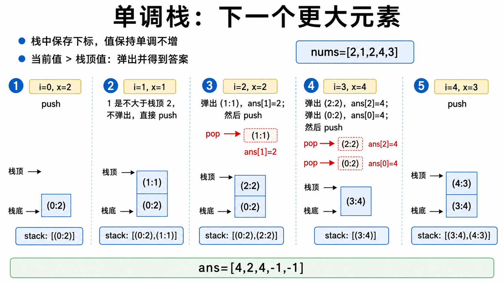
当访问到一个元素的时候，两部走：
1、栈里面存放的，小于自己的元素，被确定了答案，确定完就出栈
2、当前元素入栈（这步一定要有）
### 5.4 最小栈（辅助栈）

```cpp
class MinStack {
    stack<int> data, min_st;
public:
    void push(int x) {
        data.push(x);
        if (min_st.empty() || x <= min_st.top()) min_st.push(x);
        else min_st.push(min_st.top());
    }
    void pop() { data.pop(); min_st.pop(); }
    int top() { return data.top(); }
    int getMin() { return min_st.top(); }
};
```

>辅助栈的栈顶，就能存放最小的元素，传递信息，和主栈的高度同步，每一层保存的是从栈底到当前层的最小数！只有遇到比他更小的才更新，否则层层叠上去

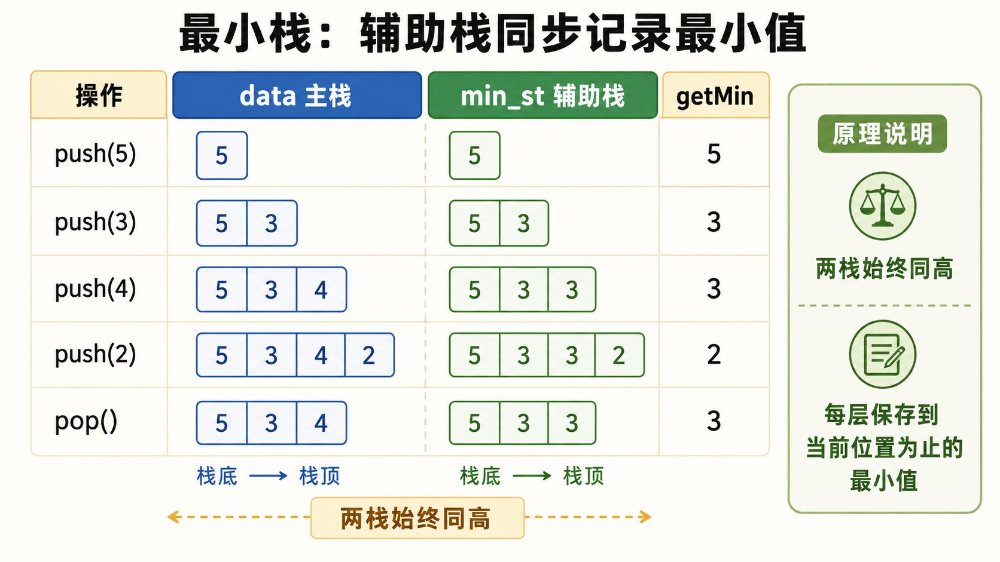

### 5.5 单调队列（双端）（求滑动窗口最大值）

```cpp
vector<int> maxSlidingWindow(vector<int>& nums, int k) {
    deque<int> dq;  // 存下标，保持单调递减
    vector<int> res;
    for (int i = 0; i < nums.size(); i++) {
        if (!dq.empty() && dq.front() <= i - k) dq.pop_front();//超出了生命周期，第一踢
        while (!dq.empty() && nums[dq.back()] <= nums[i]) dq.pop_back();//因为不符合单调递减，（新的值相同或更大，而且生存周期比比他小的长），第二踢
        dq.push_back(i);//踢完了，把下标push进去，符合了单调递减
        if (i >= k - 1) res.push_back(nums[dq.front()]);//队头下标对应的元素就是滑动窗口的最大值
    }
    return res;
}
```

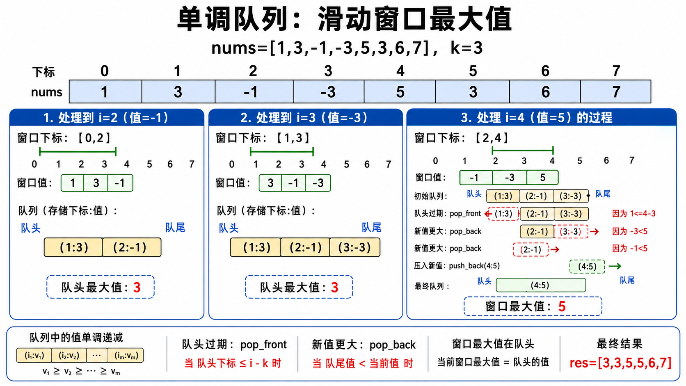
当访问到一个元素的时候，四部走：
1、队头过期风险：踢一个元素
2、新的值更大（或者相等），但是生存周期比旧的值长，应该踢了
3、踢完了，新的值插入
4、当前滑动窗口最大值就在队头
### 5.6 优先队列（大根堆/小根堆）

```cpp
// 大根堆
priority_queue<int> pq;
// 小根堆
priority_queue<int, vector<int>, greater<int>> min_pq;

// 自定义比较
auto cmp = [](Node& a, Node& b) { return a.val > b.val; };
priority_queue<Node, vector<Node>, decltype(cmp)> pq(cmp);
```

### 5.7 数据流中位数（两个堆）

```cpp
class MedianFinder {
    priority_queue<int> left;  // 大根堆，存较小的一半
    priority_queue<int, vector<int>, greater<int>> right;  // 小根堆，存较大的一半
public:
    void addNum(int num) {
        if (left.empty() || num <= left.top()) left.push(num);
        else right.push(num);
        if (left.size() > right.size() + 1) { right.push(left.top()); left.pop(); }
        else if (right.size() > left.size()) { left.push(right.top()); right.pop(); }
    }
    double findMedian() {
        if (left.size() > right.size()) return left.top();
        else return (left.top() + right.top()) / 2.0;
    }
};
```

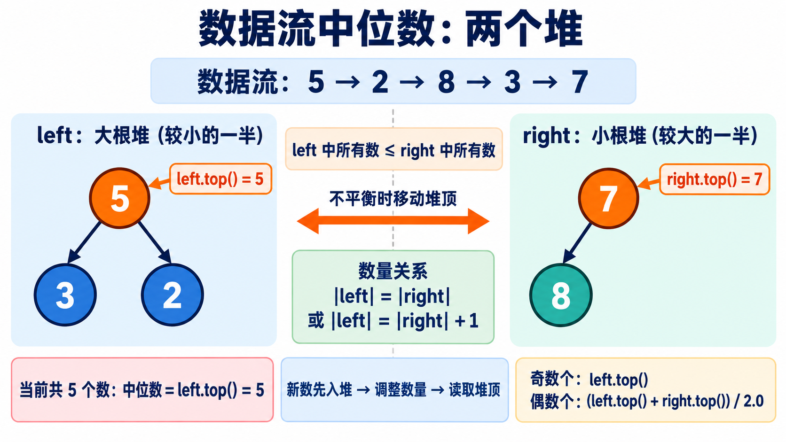
分为插入操作和删除操作：
新数先入堆：
较小的一半的最大值：
较大的一半的最小值：
### 5.8 LRU 缓存（用哈希索引实现对双向链表的O(1)查找和删除）

```cpp
class LRUCache {
    int cap;
    list<pair<int,int>> cache;  // (key, value)
    unordered_map<int, list<pair<int,int>>::iterator> mp;
public:
    LRUCache(int capacity) : cap(capacity) {}
    int get(int key) {
        if (!mp.count(key)) return -1;
        auto it = mp[key];
        auto node = *it;       // 先保存节点内容
        cache.erase(it);       // 删除旧节点（原迭代器随之失效）
        cache.push_front(node); // 重新插入到表头，表示最近使用
        mp[key] = cache.begin();
        return node.second;
    }
    void put(int key, int value) {
        if (mp.count(key)) {
            auto it = mp[key];
            cache.erase(it);
            cache.push_front({key, value});
            mp[key] = cache.begin();
        } 
        else {
            if (cache.size() == cap) {
                mp.erase(cache.back().first);
                cache.pop_back();
            }
            cache.push_front({key, value});
            mp[key] = cache.begin();
        }
    }
};
```

- **哈希表** `mp`：保存 `key → 链表节点迭代器`，负责在 `O(1)` 时间内找到节点。
- **双向链表** `cache`：负责维护使用顺序；表头是最近使用的节点，表尾是最久未使用、容量满时要淘汰的节点。
- 不使用 `list::splice` 时，访问旧节点要先保存数据，再 `erase` 旧节点、`push_front` 新节点，并更新哈希表中的迭代器；这些链表操作仍然都是 `O(1)`。

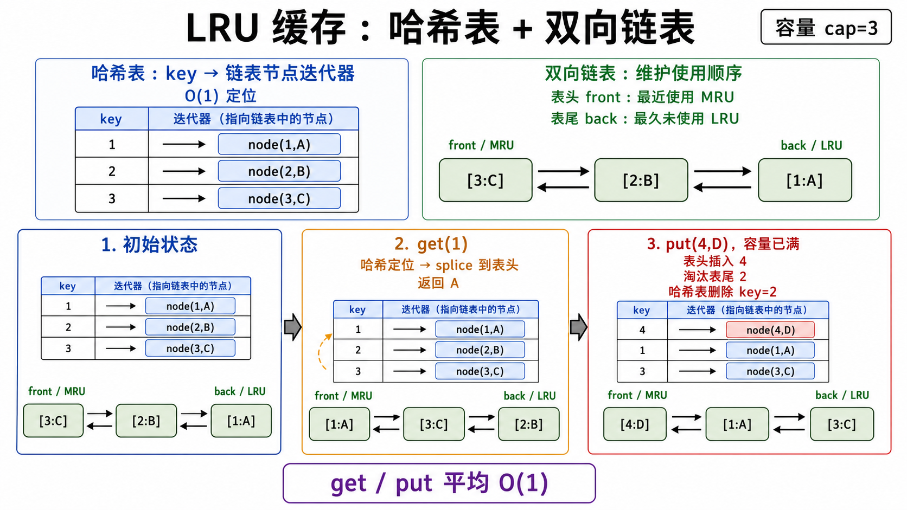

---

## 六、树与递归

### 6.1 前序遍历

```cpp
void preorder(TreeNode* root) {
    if (!root) return;
    cout << root->val;
    preorder(root->left);
    preorder(root->right);
}
```

### 6.2 中序遍历

```cpp
void inorder(TreeNode* root) {
    if (!root) return;
    inorder(root->left);
    cout << root->val;
    inorder(root->right);
}
```

### 6.3 由前序遍历和中序遍历构造二叉树

这道题的关键不是“把两个数组逐个比较”，而是利用两种遍历各自提供的信息：

- 前序遍历的第一个元素一定是当前子树的根节点；
- 在中序遍历中找到根节点后，左边部分就是左子树，右边部分就是右子树；
- 左子树的节点数量决定了前序遍历中左右子树区间的切分位置。

下面保留原来的线性查找写法：每次递归都在当前中序区间中寻找根节点的位置。真正需要理清的是找到位置 `i` 之后，前序和中序两个区间怎样同步切分。

```cpp
class Solution {
public:
    TreeNode* buildTree(vector<int>& preorder, vector<int>& inorder) {
        int n = preorder.size();
        return build(preorder, 0, n - 1, inorder, 0, n - 1);
    }

    TreeNode* build(vector<int>& preorder, int l1, int r1,
                    vector<int>& inorder, int l2, int r2) {
        if (l1 > r1) return nullptr;

        int gen = preorder[l1];
        int i;
        for (i = l2; i <= r2; i++) {
            if (inorder[i] == gen) break;
        }

        TreeNode* root = new TreeNode(gen);
        root->left = build(preorder, l1 + 1, l1 + i - l2,
                           inorder, l2, i - 1);
        root->right = build(preorder, l1 + i - l2 + 1, r1,
                            inorder, i + 1, r2);
        return root;
    }
};
```

递归区间的含义如下：`l1..r1` 是当前子树在前序数组中的范围，`l2..r2` 是当前子树在中序数组中的范围。根节点在中序数组中的位置是 `i`，所以左子树节点数为 `leftSize = i - l2`。

- 左子树在中序中的范围是 `[l2, i - 1]`，共有 `i - l2` 个节点。因此它在前序中从根节点后面开始，范围是 `[l1 + 1, l1 + i - l2]`。
- 右子树紧接在左子树之后，所以它在前序中的范围从 `l1 + i - l2 + 1` 开始，一直到 `r1`；在中序中的范围是 `[i + 1, r2]`。

因此下面两行正好把同一棵子树在两种遍历中的区间对应起来：

```cpp
root->left = build(preorder, l1 + 1, l1 + i - l2, inorder, l2, i - 1);
root->right = build(preorder, l1 + i - l2 + 1, r1, inorder, i + 1, r2);
```

当前写法在每个递归层都要扫描中序区间寻找 `i`，时间复杂度最坏为 $O(n^2)$；递归栈的额外空间复杂度为 $O(n)$。如果用哈希表预先记录中序位置，才可以把查找根节点位置降为 $O(1)$。

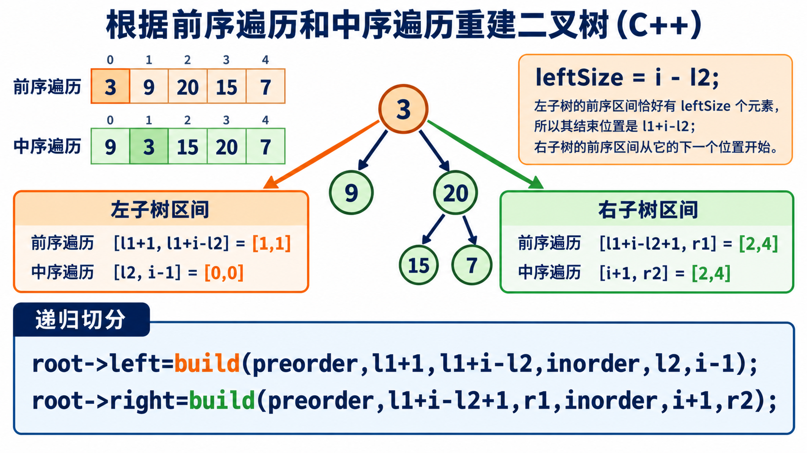

图中示例：前序遍历为 `3, 9, 20, 15, 7`，中序遍历为 `9, 3, 15, 20, 7`。先取前序第一个元素 `3` 作为根，再用它在中序中的位置切出左子树和右子树，之后对两个区间重复相同过程。

### 6.4 层序遍历

```cpp
vector<vector<int>> levelOrder(TreeNode* root) {
    vector<vector<int>> res;
    if (!root) return res;
    queue<TreeNode*> q;
    q.push(root);
    while (!q.empty()) {
        vector<int> level;
        int sz = q.size();
        while (sz--) {
            Treenode* node = q.front(); q.pop();
            level.push_back(node->val);
            if (node->left) q.push(node->left);
            if (node->right) q.push(node->right);
        }
        res.push_back(level);
    }
    return res;
}
```

### 6.5 前序类：路径记录（二叉树所有路径）

```cpp
void dfs(TreeNode* root, string path, vector<string>& res) {
    if (!root) return;
    path += to_string(root->val);
    if (!root->left && !root->right) { res.push_back(path); return; }
    dfs(root->left, path + "->", res);
    dfs(root->right, path + "->", res);
}
```

### 6.6 中序类：验证是否为BST（人话：中序遍历是严格升序）

```cpp
TreeNode* pre;
bool isValid;

void dfs(TreeNode* root) {
    if (!root || !isValid) return;

    dfs(root->left);

    if (pre !=nullptr && root->val <= pre->val) {
        isValid = false;
        return;
    }
    pre = root;

    dfs(root->right);
}

bool isValidBST(TreeNode* root) {
    pre = nullptr;      // 每次调用前必须重置
    isValid = true;
    dfs(root);
    return isValid;
}

```
### 6.7 中序类：BST 第 K 小元素（人话：中序遍历到第k个停止）

```cpp
int cnt=0;
int ans;
    void dfs(TreeNode *root,int k){
        if(root->left) dfs(root->left,k);
        cnt++;
        if(cnt==k){
            ans=root->val;
            return ;
        }
        if (root->right) dfs(root->right,k);
        return;
    }

    int kthSmallest(TreeNode* root, int k) {
        dfs(root,k);
        return ans;
    }
```

### 6.8 后序类：二叉树的高度

```cpp
int maxDepth(TreeNode* root) {
    if (!root) return 0;
    return max(maxDepth(root->left), maxDepth(root->right)) + 1;
}
```

### 6.9 后序类：平衡二叉树

```cpp
int height(TreeNode* root) {
    if (!root) return 0;
    int l = height(root->left), r = height(root->right);
    if (l == -1 || r == -1 || abs(l - r) > 1) return -1;
    return max(l, r) + 1;
}
```

### 6.10 后序类：二叉树直径

```cpp
int diameter = 0;
int dfs(TreeNode* root) {
    if (!root) return 0;
    int l = dfs(root->left), r = dfs(root->right);
    diameter = max(diameter, l + r);
    return max(l, r) + 1;
}
```

### 6.11 后序类：最大路径和

```cpp
int maxSum = INT_MIN;
int maxGain(TreeNode* root) {
    if (!root) return 0;
    int l = max(0, maxGain(root->left));
    int r = max(0, maxGain(root->right));
    maxSum = max(maxSum, root->val + l + r);
    return root->val + max(l, r);
}
```

### 6.12 最近公共祖先(LCA)

```cpp
TreeNode* lowestCommonAncestor(TreeNode* root, TreeNode* p, TreeNode* q) {
    if (!root || root == p || root == q) return root;
    TreeNode* l = lowestCommonAncestor(root->left, p, q);
    TreeNode* r = lowestCommonAncestor(root->right, p, q);
    if (l && r) return root;
    return l ? l : r;
}
```

### 6.13 Trie 前缀树

```cpp
class Trie {
    struct Node {
        Node* child[26] = {};
        bool isEnd = false;
    };
    Node* root = new Node();
public:
    void insert(string word) {
        Node* p = root;
        for (char c : word) {
            int i = c - 'a';
            if (!p->child[i]) p->child[i] = new Node();
            p = p->child[i];
        }
        p->isEnd = true;
    }
    bool search(string word) {
        Node* p = root;
        for (char c : word) {
            int i = c - 'a';
            if (!p->child[i]) return false;
            p = p->child[i];
        }
        return p->isEnd;
    }
    bool startsWith(string prefix) {
        Node* p = root;
        for (char c : prefix) {
            int i = c - 'a';
            if (!p->child[i]) return false;
            p = p->child[i];
        }
        return true;
    }
};
```

---

## 七、图论

### 7.1 邻接表

```cpp
vector<vector<int>> adj(n);
adj[u].push_back(v);
```

### 7.2 带权邻接表

```cpp
vector<vector<pair<int,int>>> adj(n);  // (邻居, 权重)
adj[u].push_back({v, w});
```

### 7.3 邻接矩阵

```cpp
int g[N][N];
g[u][v] = w;
```

### 7.4 图的 DFS 遍历

```cpp
void dfs(int u) {
    vis[u] = true;
    for (int v : adj[u])
        if (!vis[v]) dfs(v);
}
```

### 7.5 图的 BFS 遍历

```cpp
void bfs(int start) {
    queue<int> q;
    q.push(start);
    vis[start] = true;
    while (!q.empty()) {
        int u = q.front(); q.pop();
        for (int v : adj[u])
            if (!vis[v]) { vis[v] = true; q.push(v); }
    }
}
```

### 7.6 拓扑排序（Kahn 算法）

```cpp
vector<int> topoSort(int n, vector<vector<int>>& edges) {
    vector<int> indeg(n, 0);
    vector<vector<int>> adj(n);
    for (auto& e : edges) { 
	    adj[e[0]].push_back(e[1]); 
	    indeg[e[1]]++; 
    }
    queue<int> q;
    for (int i = 0; i < n; i++) if (indeg[i] == 0) q.push(i);
    vector<int> order;
    while (!q.empty()) {
        int u = q.front(); 
        q.pop();
        order.push_back(u);
        for (int v : adj[u])
		    indeg[v]--;
            if (indeg[v] == 0) q.push(v);
    }
    return order;  // 但是，若order.size() < n 说明有环
}
```

### 7.7 Dijkstra（单源最短路，含堆优化，不可负权）
图我用的都是邻接表，存放一个顶点能到达的<

朴素版本：o（n²）
```c++
vector<int> dijkstra(int start, vector<vector<pair<int,int>>>& adj,int n) {
    vector<int> dist(n, INT_MAX);
    dist[start] = 0;
    
    vector<bool> visited(n, false);   // 记录每个顶点是否已确定最短距离
   
    // 每次循环确定一个顶点的最短距离
    for (int j = 0; j < n; j++) {
        // 1. 在所有未访问过的顶点中，选出dist最小的顶点 u
        int u = -1;
        int minDist = INT_MAX;
        for (int i = 0; i < n; ++i) {
            if (!visited[i] && dist[i] < minDist) {
                minDist = dist[i];
                u = i;
            }
        }
        // 如果 u 仍然为 -1，说明剩余顶点不可达（图不连通），提前结束
        if (u == -1) break;
        //标记u顶点的最小距离已知
        visited[u] = true;
        // 2. 用 u 的邻接边松弛
        for (auto [v, w] : adj[u]) {
            if (!visited[v] && dist[u] + w < dist[v]) {
                dist[v] = dist[u] + w;
            }
        }
    }
    return dist;
}
```

堆优化版：o(mlogn)

```cpp
vector<int> dijkstra(int start, vector<vector<pair<int,int>>>& adj,int n) {                     
    vector<int> dist(n, INT_MAX);
    dist[start] = 0;            
    //为了方便排序，把距离放在前面的第一个字段
    priority_queue<pair<int,int>, vector<pair<int,int>>, greater<>> pq;
    pq.push({0, start});        

    //主循环：不断从堆中取出“当前距离最小”的顶点
    while (!pq.empty()) {
        // 取出当前已知的距离最小的顶点
        auto [d, u] = pq.top(); 
        pq.pop();
        //这个u节点的最短距离已经被确定了，这个d就是之前没被清理掉的垃圾
        if (d > dist[u]) continue;
		
        for (auto &[to, cost] : adj[u]) {
            // 借助当前顶点更新到其他顶点的最短距离，这步没区别
            if (dist[u] + cost < dist[to]) {
                dist[to] = dist[u] + cost;          // 更新最短距离
                pq.push({dist[to], to});          // 知道了到某个顶点的最短距离，加入！
            }
        }
    }

    return dist;
}
```

### 7.8 Floyd（多源最短路，可负权）
这个没办法，必须得用邻接矩阵,因为要查一个点到另一点的距离，o(1)复杂度

```cpp
//对不合法的边进行初始化：
    for (int i = 0; i < n; i ++ )
        for (int j = 0; j < n; j ++ )
            if (i == j) d[i][j] = 0;
            else d[i][j] = INF;
//三重循环算法，只能用邻接矩阵来实现
void floyd(vector<vector<int>>& dist, int n) {
    for (int k = 0; k < n; k++)//枚举借用的顶点，三重循环
        for (int i = 0; i < n; i++)
            for (int j = 0; j < n; j++)
                dist[i][j] = min(dist[i][j], dist[i][k] + dist[k][j]);
}
```

### 7.9 Bellman-Ford（单源最短路，可负权）

```cpp
struct Edge { int u, v, w; };
int bellmanFord(vector<Edge>& edges, int n, int start) {
    vector<int> dist(n, INT_MAX);
    dist[start] = 0;
    for (int i = 0; i < n - 1; i++)
        for (auto& e : edges)
            if (dist[e.u] != INT_MAX)
                dist[e.v] = min(dist[e.v], dist[e.u] + e.w);
    // 第 n 轮检查负环
    for (auto& e : edges)
        if (dist[e.u] != INT_MAX && dist[e.u] + e.w < dist[e.v])
            return -1;  // 存在负环
    return 0;
}
```
  
### 7.10 Prim（最小生成树，含堆优化）

图仍然使用邻接表。`minEdge[i]` 表示顶点 `i` 连接到当前生成树所需的最小边权。

未堆优化：

```cpp
int prim(vector<vector<pair<int,int>>>& adj, int n) {
    vector<int> minEdge(n, INT_MAX);
    vector<bool> visited(n, false);
    minEdge[0] = 0;                      // 从顶点 0 开始
    int ans = 0;
    // 每轮确定一个加入最小生成树的顶点
    for (int count = 0; count < n; count++) {
        // 1. 在所有未访问顶点中，选 minEdge 最小的顶点 u
        int u = -1;
        for (int i = 0; i < n; i++)
            if (!visited[i] && (u == -1 || minEdge[i] < minEdge[u]))
                u = i;
        // 找不到可加入的顶点，说明原图不连通
        if (u == -1 || minEdge[u] == INT_MAX) return -1;

        visited[u] = true;
        ans += minEdge[u];
        // 2. 用 u 的邻接边更新其他顶点连入生成树的最小边权
        for (auto [v, w] : adj[u])
            if (!visited[v] && w < minEdge[v])
                minEdge[v] = w;          // 注意：这里是 w，不是 minEdge[u] + w
    }
    return ans;
}
```

堆优化版：

```cpp
int prim(vector<vector<pair<int,int>>>& adj, int n) {
    vector<bool> visited(n, false);

    // 小根堆存储（连入生成树的边权, 顶点）
    priority_queue<pair<int,int>, vector<pair<int,int>>, greater<>> pq;
    pq.push({0, 0});

    int ans = 0, count = 0;
    while (!pq.empty()) {
        auto [w, u] = pq.top();
        pq.pop();

        // 同一顶点可能由多条边入堆，已经加入生成树就跳过
        if (visited[u]) continue;

        visited[u] = true;
        ans += w;
        count++;

        // 把从生成树通向未访问顶点的候选边加入堆
        for (auto [v, edgeWeight] : adj[u])
            if (!visited[v])
                pq.push({edgeWeight, v});
    }

    return count == n ? ans : -1;        // 不连通时不存在生成树
}
```


### 7.11 Kruskal（最小生成树）
时间复杂度是o(eloge)，主要时间花费在对边进行排序上
```cpp
int kruskal(vector<Edge>& edges, int n) {
    // 1. 所有边按权值从小到大排序
    sort(edges.begin(), edges.end(),
         [](const Edge& a, const Edge& b) { return a.w < b.w; });

    parent.resize(n+1);
    for (int i = 1; i <= n; i ++ ) parent[i] = i;    // 初始化并查集,n个边1-n,每个边的父亲节点是自己
    int ans = 0, cnt = 0;

    // 2. 依次尝试最小的边；端点不在同一集合时才选取
    for (auto e : edges) {
        if (!unite(e.u, e.v)) continue;
        ans += e.w;
        cnt++;
        if (cnt == n - 1) return ans;  
    }
	//如果选不到这么多条边，图不连通
    return -1;                              // 原图不连通
}
```

### 7.12 并查集

```cpp
vector<int> parent;

int find(int x) {
    if (parent[x] != x)
        parent[x] = find(parent[x]);       // 路径压缩
    return parent[x];
}

bool unite(int a, int b) {
    int rootA = find(a), rootB = find(b);//已经是根节点了
    if (rootA == rootB) return false;       // 已在同一集合
    else{
	    parent[rootA] = rootB;                  
	    return true;//合并一下A和B
    }
}//如果u和v在同一集合，返回不能合并
```

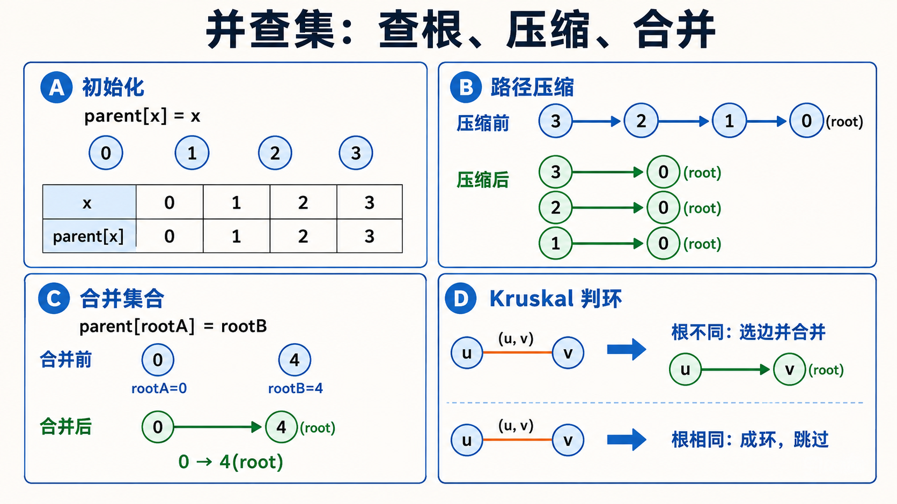

### 7.13 二分图判定

```cpp
bool isBipartite(vector<vector<int>>& adj) {
    int n = adj.size();
    vector<int> color(n, -1);
    queue<int> q;
    for (int i = 0; i < n; i++) {
        if (color[i] != -1) continue;
        color[i] = 0; q.push(i);
        while (!q.empty()) {
            int u = q.front(); q.pop();
            for (int v : adj[u]) {
                if (color[v] == -1) { color[v] = color[u] ^ 1; q.push(v); }
                else if (color[v] == color[u]) return false;
            }
        }
    }
    return true;
}
```

---

## 八、搜索与回溯

### 8.1 全排列

```cpp
void dfs(vector<int>& nums, vector<int>& path, vector<bool>& used, vector<vector<int>>& res) {
    if (path.size() == nums.size()) { res.push_back(path); return; }
    for (int i = 0; i < nums.size(); i++) {
        if (used[i]) continue;
        used[i] = true;
        path.push_back(nums[i]);
        dfs(nums, path, used, res);
        path.pop_back();
        used[i] = false;
    }
}
```

全排列的搜索树中，每一层都可以尝试任意一个还没有使用过的元素，所以需要用 `used` 标记选择状态。到达叶子节点时得到一个完整排列；递归返回后执行 `pop_back()` 和 `used[i] = false`，才能恢复现场并尝试下一个分支。

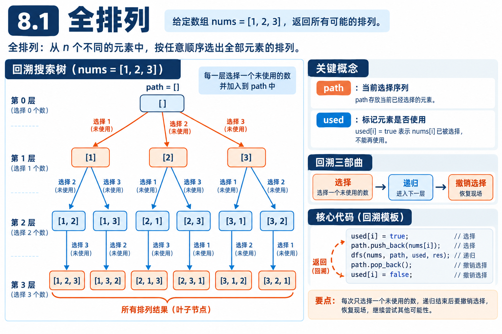

### 8.2 组合

```cpp
void dfs(int start, int k, int n, vector<int>& path, vector<vector<int>>& res) {
    if (path.size() == k) { res.push_back(path); return; }
    for (int i = start; i <= n; i++) {
        path.push_back(i);
        dfs(i + 1, k, n, path, res);
        path.pop_back();
    }
}
```

组合不考虑元素顺序，因此每次递归只从 `start` 开始选择，并把下一层起点设为 `i + 1`。这样搜索树始终向更大的下标前进，天然排除了 `[2,1]`、`[3,1]` 这类重复组合。

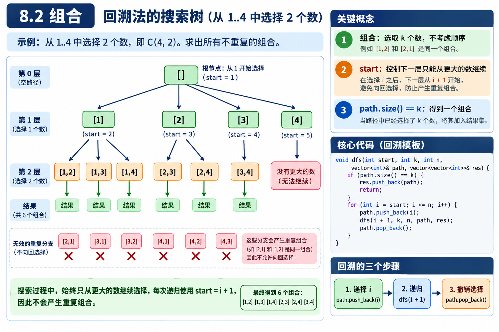

### 8.3 棋盘型回溯（N 皇后）

```cpp
void dfs(int row, int n, vector<int>& col, vector<int>& diag1, vector<int>& diag2,
         vector<string>& board, vector<vector<string>>& res) {
    if (row == n) { res.push_back(board); return; }
    for (int c = 0; c < n; c++) {
        if (col[c] || diag1[row + c] || diag2[row - c + n - 1]) continue;
        col[c] = diag1[row + c] = diag2[row - c + n - 1] = 1;
        board[row][c] = 'Q';
        dfs(row + 1, n, col, diag1, diag2, board, res);
        board[row][c] = '.';
        col[c] = diag1[row + c] = diag2[row - c + n - 1] = 0;
    }
}
```

### 8.4 切割型回溯（回文分割）

```cpp
void dfs(int start, string& s, vector<string>& path, vector<vector<string>>& res) {
    if (start == s.size()) { res.push_back(path); return; }
    for (int i = start; i < s.size(); i++) {
        if (!isPalindrome(s, start, i)) continue;
        path.push_back(s.substr(start, i - start + 1));
        dfs(i + 1, s, path, res);
        path.pop_back();
    }
}
```

### 8.5 BFS 最短状态搜索（锁的最短转换）

```cpp
int bfs(string start, string target, unordered_set<string>& dead) {
    if (dead.count(start)) return -1;
    queue<pair<string,int>> q;
    unordered_set<string> vis;
    q.push({start, 0}); vis.insert(start);
    while (!q.empty()) {
        auto [cur, step] = q.front(); q.pop();
        if (cur == target) return step;
        for (int i = 0; i < 4; i++) {
            for (int d : {-1, 1}) {
                string nxt = cur;
                nxt[i] = (nxt[i] - '0' + d + 10) % 10 + '0';
                if (!vis.count(nxt) && !dead.count(nxt)) {
                    vis.insert(nxt);
                    q.push({nxt, step + 1});
                }
            }
        }
    }
    return -1;
}
```

### 8.6 排序后去重（同一层不选相同元素）

```cpp
sort(nums.begin(), nums.end());
for (int i = start; i < nums.size(); i++) {
    if (i > start && nums[i] == nums[i-1]) continue;  // 去重
    // ...
}
```

### 8.7 可行性剪枝

```cpp
if (path.size() + (n - start) < k) return;  // 剩余元素不够
```

---

## 九、贪心与区间问题

### 9.1 最大不相交区间数量

```cpp
int maxNonOverlap(vector<vector<int>>& intervals) {
    sort(intervals.begin(), intervals.end(),
         [](auto& a, auto& b){ return a[1] < b[1]; });
    int ans = 0, end = -1e9;
    for (auto& p : intervals) {
        if (p[0] > end) { ans++; end = p[1]; }
    }
    return ans;
}
```

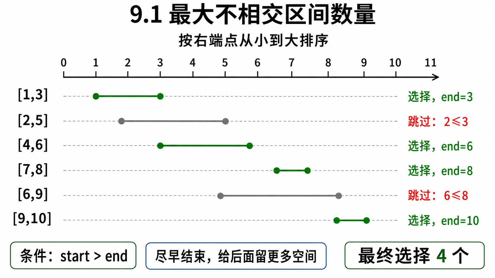

### 9.2 区间覆盖

```cpp
int minCover(vector<pair<int,int>>& segs, int L, int R) {
    sort(segs.begin(), segs.end());
    int ans = 0, cur = L, i = 0;
    while (cur < R) {
        int nxt = cur;
        while (i < segs.size() && segs[i].first <= cur)
            nxt = max(nxt, segs[i++].second);
        if (nxt == cur) return -1;  // 无法覆盖
        ans++; cur = nxt;
    }
    return ans;
}
```

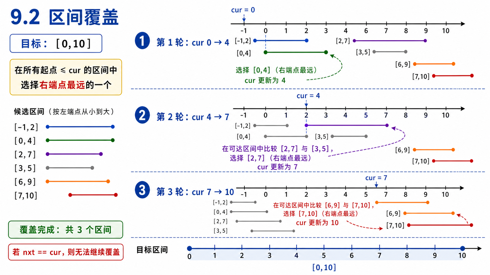

### 9.3 区间分组

```cpp
int minGroups(vector<vector<int>>& intervals) {
    sort(intervals.begin(), intervals.end());
    priority_queue<int, vector<int>, greater<int>> pq;  // 各组右端点
    for (auto& p : intervals) {
        if (!pq.empty() && pq.top() < p[0]) pq.pop();
        pq.push(p[1]);
    }
    return pq.size();
}
```

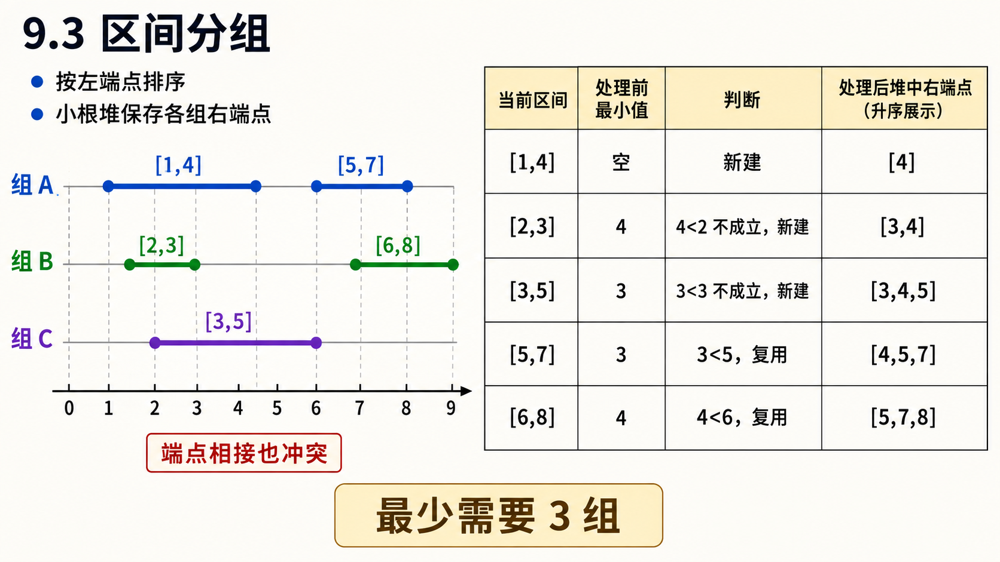

### 9.4 跳跃游戏 II（最少跳跃次数）

```cpp
int jump(vector<int>& nums) {
    int ans = 0, curEnd = 0, farthest = 0;
    for (int i = 0; i < nums.size() - 1; i++) {
        farthest = max(farthest, i + nums[i]);
        if (i == curEnd) { 
            ans++; 
            curEnd = farthest; }
    }
    return ans;
}
```

### 9.5 任务调度（最短时间间隔）

```cpp
int leastInterval(vector<char>& tasks, int n) {
    vector<int> cnt(26, 0);
    for (char c : tasks) cnt[c - 'A']++;
    int mx = *max_element(cnt.begin(), cnt.end());
    int maxCnt = 0;
    for (int c : cnt) if (c == mx) maxCnt++;
    return max((int)tasks.size(), (mx - 1) * (n + 1) + maxCnt);
}
```

---

## 十、动态规划

### 10.1 爬楼梯

```cpp
int climbStairs(int n) {
    int a = 1, b = 1;
    for (int i = 2; i <= n; i++) {
        int c = a + b; 
        a = b; 
        b = c;
    }
    return b;
}
```
### 10.2 最大子数组和

dp含义：以当前数组结尾的最大子数组和

这只取决于dp[i-1]，如果dp[i-1]<0，那么dp[i]就是nums[i]；
否则dp[i]=dp[i-1]+nums[i]
```cpp
int maxSubArray(vector<int>& nums) {
    int dp = nums[0], ans = nums[0];
    for (int i = 1; i < nums.size(); i++) {
        dp = max(dp + nums[i], nums[i]);
        ans = max(ans, dp);
    }
    return ans;
}
```

### 10.3 打家劫舍

```cpp
int rob(vector<int>& nums) {
    int pre2 = 0, pre1 = 0;
    for (int x : nums) {
        int cur = max(pre1, pre2 + x);
        pre2 = pre1; pre1 = cur;
    }
    return pre1;
}
```

### 10.4 最长递增子序列（LIS）

```cpp
int lengthOfLIS(vector<int>& nums) {
    vector<int> dp;
    for (int x : nums) {
        auto it = lower_bound(dp.begin(), dp.end(), x);
        if (it == dp.end()) dp.push_back(x);
        else *it = x;
    }
    return dp.size();
}
```

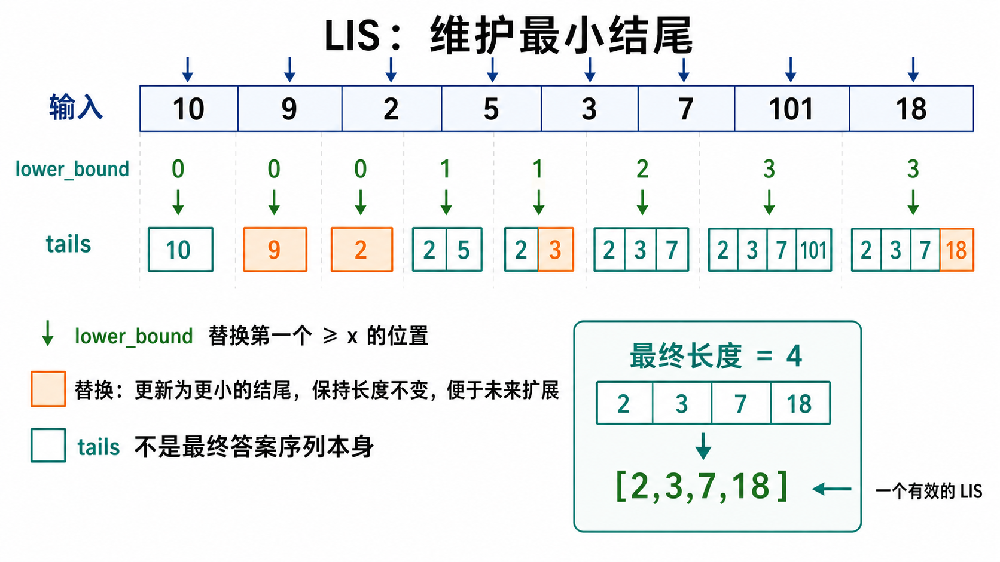

### 10.5 最长公共子序列（LCS）

```cpp
int longestCommonSubsequence(string& a, string& b) {
    int n = a.size(), m = b.size();
    vector<vector<int>> dp(n + 1, vector<int>(m + 1, 0));
    for (int i = 1; i <= n; i++)
        for (int j = 1; j <= m; j++)
            dp[i][j] = (a[i-1] == b[j-1]) ? dp[i-1][j-1] + 1
                        : max(dp[i-1][j], dp[i][j-1]);
    return dp[n][m];
}
```

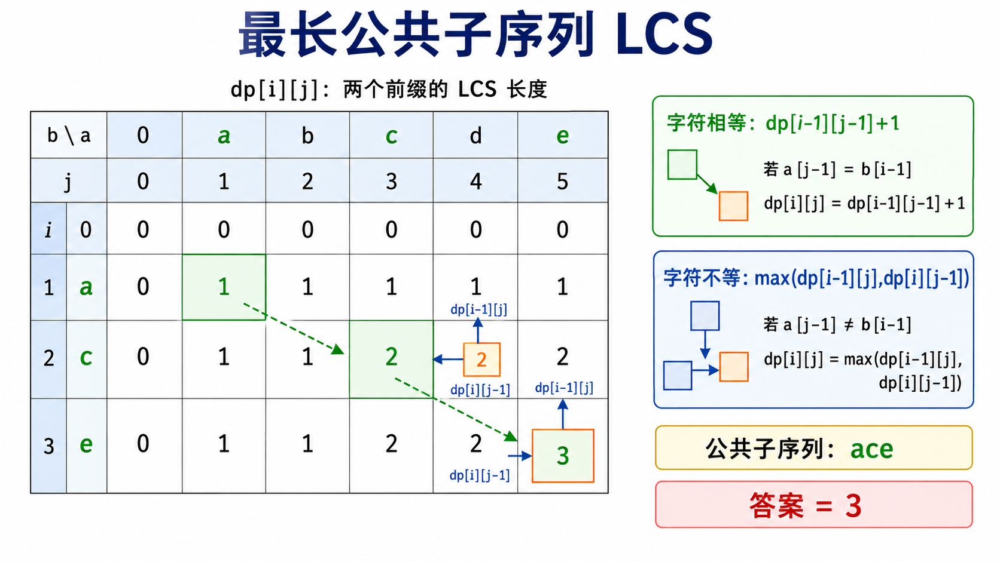

### 10.6 编辑距离

```cpp
int minDistance(string& a, string& b) {
    int n = a.size(), m = b.size();
    vector<vector<int>> dp(n + 1, vector<int>(m + 1));
    for (int i = 0; i <= n; i++) dp[i][0] = i;
    for (int j = 0; j <= m; j++) dp[0][j] = j;
    for (int i = 1; i <= n; i++)
        for (int j = 1; j <= m; j++)
            dp[i][j] = min({dp[i-1][j] + 1, dp[i][j-1] + 1,
                           dp[i-1][j-1] + (a[i-1] != b[j-1])});
    return dp[n][m];
}
```

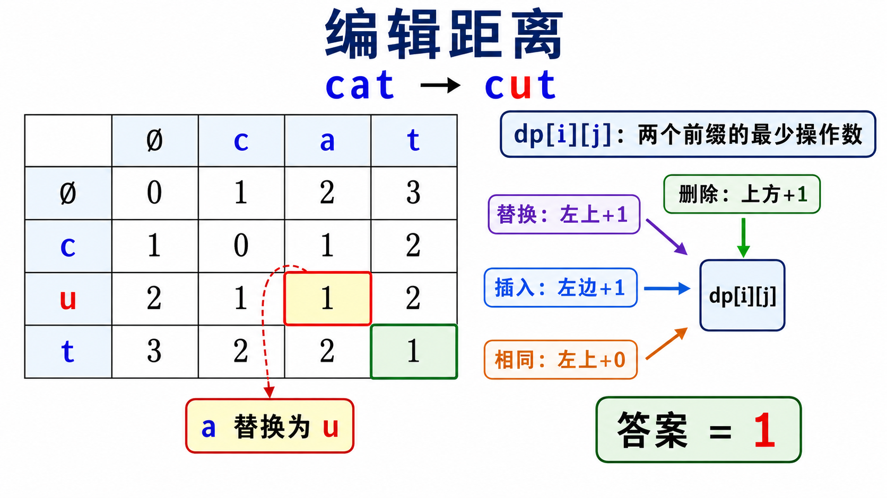
### 10.7 0-1 背包

**二维 DP（最容易理解）：**

```cpp
int knapsack01_2D(vector<int>& w, vector<int>& v, int W) {
    int n = w.size();
    // dp[i][j]：只看前 i 个物品，容量为 j 时的最大价值
    vector<vector<int>> dp(n + 1, vector<int>(W + 1, 0));

    for (int i = 1; i <= n; i++) {
        for (int j = 0; j <= W; j++) {
            dp[i][j] = dp[i - 1][j];  // 不选第 i 个物品
            if (j >= w[i - 1]) {
                dp[i][j] = max(dp[i][j],
                               dp[i - 1][j - w[i - 1]] + v[i - 1]);
            }
        }
    }
    return dp[n][W];
}
```

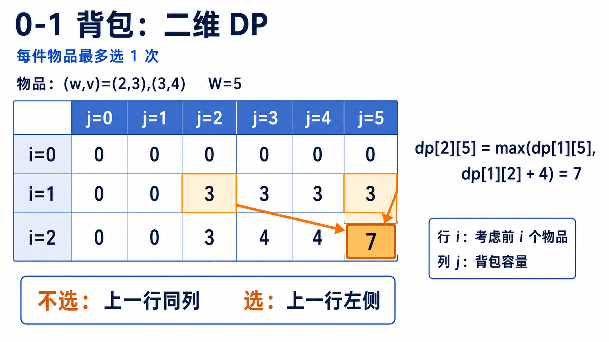

关键：第 `i` 个物品只能用一次，所以“选它”时也必须回到上一行 `i-1`。

**一维 DP（空间优化）：**

```cpp
int knapsack01(vector<int>& w, vector<int>& v, int W) {
    vector<int> dp(W + 1, 0);
    for (int i = 0; i < w.size(); i++)
        for (int j = W; j >= w[i]; j--)
            dp[j] = max(dp[j], dp[j - w[i]] + v[i]);
    return dp[W];
}
```

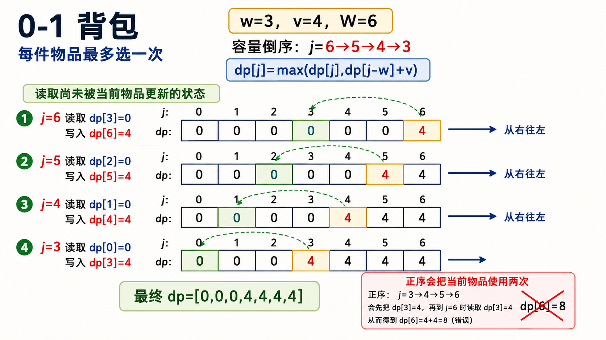

### 10.8 完全背包

**二维 DP（最容易理解）：**

```cpp
int knapsackComplete_2D(vector<int>& w, vector<int>& v, int W) {
    int n = w.size();
    // dp[i][j]：只看前 i 种物品，容量为 j 时的最大价值
    vector<vector<int>> dp(n + 1, vector<int>(W + 1, 0));

    for (int i = 1; i <= n; i++) {
        for (int j = 0; j <= W; j++) {
            dp[i][j] = dp[i - 1][j];  // 不选第 i 种物品
            if (j >= w[i - 1]) {
                dp[i][j] = max(dp[i][j],
                               dp[i][j - w[i - 1]] + v[i - 1]);
            }
        }
    }
    return dp[n][W];
}
```

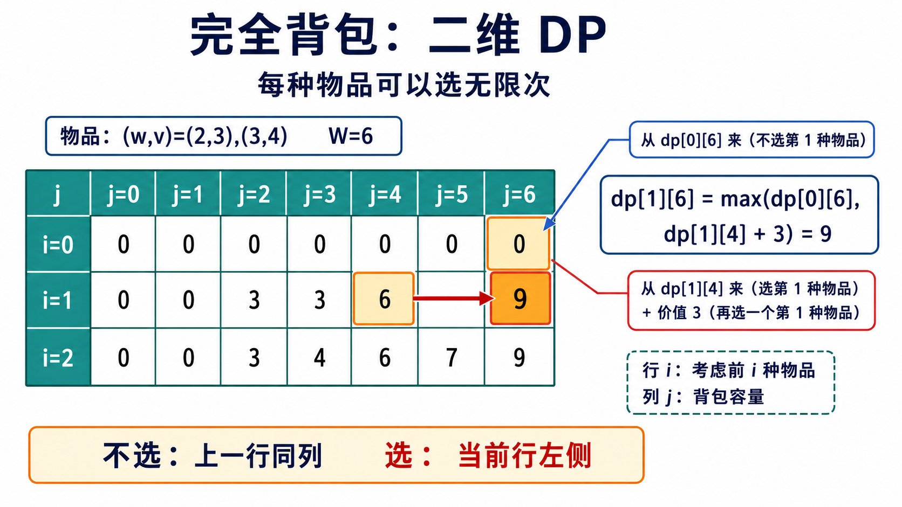

关键：同一种物品可以重复选，所以“选它”时留在当前行 `i`，继续使用它。

**一维 DP（空间优化）：**

```cpp
int knapsackComplete(vector<int>& w, vector<int>& v, int W) {
    vector<int> dp(W + 1, 0);
    for (int i = 0; i < w.size(); i++)
        for (int j = w[i]; j <= W; j++)
            dp[j] = max(dp[j], dp[j - w[i]] + v[i]);
    return dp[W];
}
```

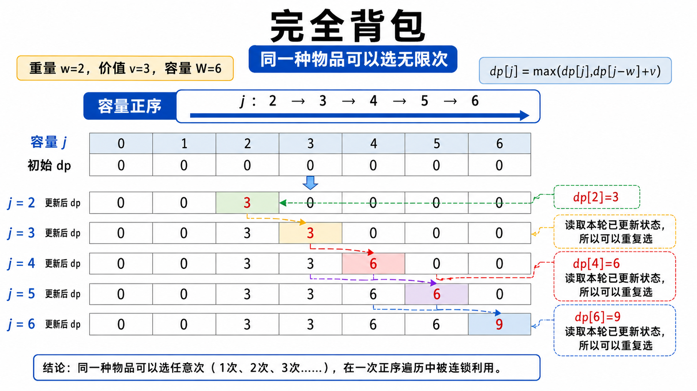

### 10.9 多重背包

**二维 DP（最容易理解）：**

```cpp
int knapsackMultiple_2D(vector<int>& w, vector<int>& v,
                        vector<int>& s, int W) {
    int n = w.size();
    // dp[i][j]：只看前 i 种物品，容量为 j 时的最大价值
    vector<vector<int>> dp(n + 1, vector<int>(W + 1, 0));

    for (int i = 1; i <= n; i++) {
        for (int j = 0; j <= W; j++) {
            // 第 i 种物品选 k 个：0 <= k <= 库存，且不能超过容量
            for (int k = 0;
                 k <= s[i - 1] && k * w[i - 1] <= j;
                 k++) {
                dp[i][j] = max(dp[i][j],
                               dp[i - 1][j - k * w[i - 1]]
                               + k * v[i - 1]);
            }
        }
    }
    return dp[n][W];
}
```

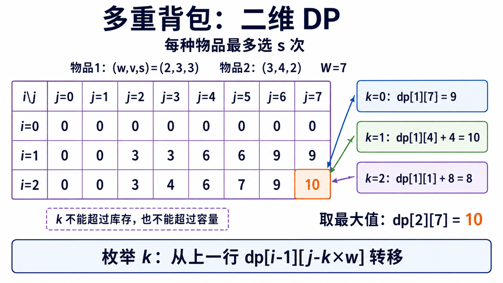

关键：枚举第 `i` 种物品选 `k` 个，再从上一行查剩余容量。这个版本最直观，但需要多枚举一层 `k`。

**一维 DP（二进制拆分优化）：**

```cpp
int knapsackMultiple(vector<int>& w, vector<int>& v, vector<int>& s, int W) {
    vector<int> dp(W + 1, 0);
    for (int i = 0; i < w.size(); i++) {
        int k = 1;
        while (s[i] > 0) {
            int cnt = min(k, s[i]);
            for (int j = W; j >= w[i] * cnt; j--)
                dp[j] = max(dp[j], dp[j - w[i] * cnt] + v[i] * cnt);
            s[i] -= cnt; k *= 2;
        }
    }
    return dp[W];
}
```

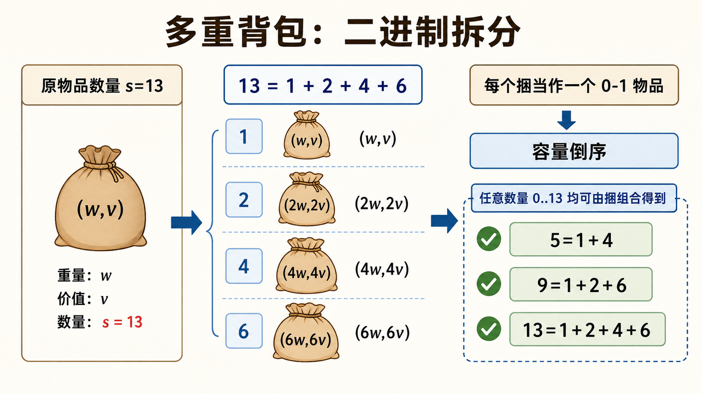

### 10.10 石子合并（前缀和+区间 DP）

```cpp
int stoneMerge(vector<int>& a) {
    int n = a.size();
    vector<int> pre(n + 1, 0);
    for (int i = 0; i < n; i++) pre[i+1] = pre[i] + a[i];
    vector<vector<int>> dp(n, vector<int>(n, 0));
    for (int len = 2; len <= n; len++)
        for (int i = 0; i + len - 1 < n; i++) {
            int j = i + len - 1;
            dp[i][j] = INT_MAX;
            for (int k = i; k < j; k++)
                dp[i][j] = min(dp[i][j], dp[i][k] + dp[k+1][j] + pre[j+1] - pre[i]);
        }
    return dp[0][n-1];
}
```

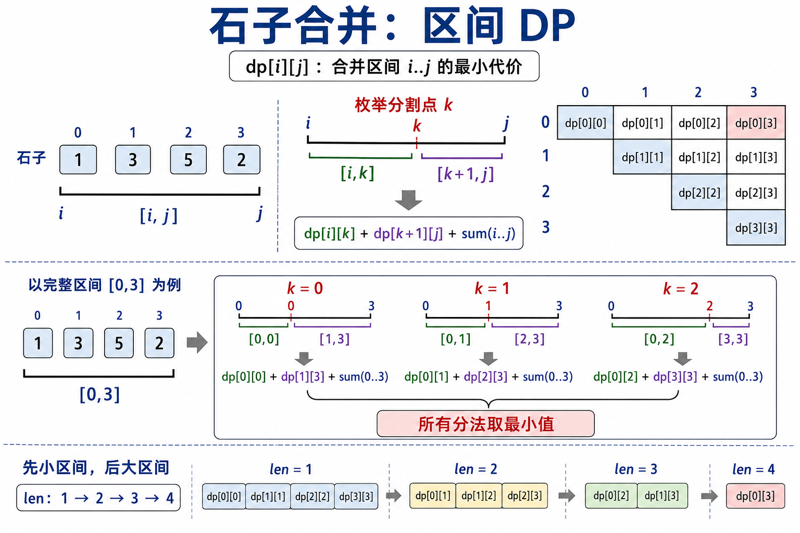

### 10.11 最长回文子序列（区间 DP）

```cpp
int longestPalindromeSubseq(string& s) {
    int n = s.size();
    vector<vector<int>> dp(n, vector<int>(n, 0));
    for (int i = n - 1; i >= 0; i--) {
        dp[i][i] = 1;
        for (int j = i + 1; j < n; j++) {
            if (s[i] == s[j]) dp[i][j] = dp[i+1][j-1] + 2;
            else dp[i][j] = max(dp[i+1][j], dp[i][j-1]);
        }
    }
    return dp[0][n-1];
}
```

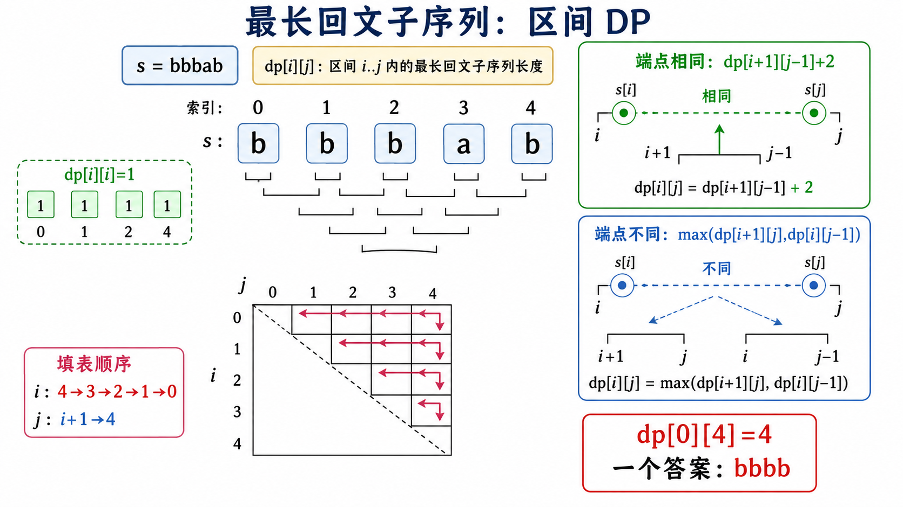

### 10.12 树形 DP（没有上司的舞会）

```cpp
void dfs(int u) {
    dp[u][0] = 0; dp[u][1] = happy[u];
    for (int v : children[u]) {
        dfs(v);
        dp[u][0] += max(dp[v][0], dp[v][1]);
        dp[u][1] += dp[v][0];
    }
}
```

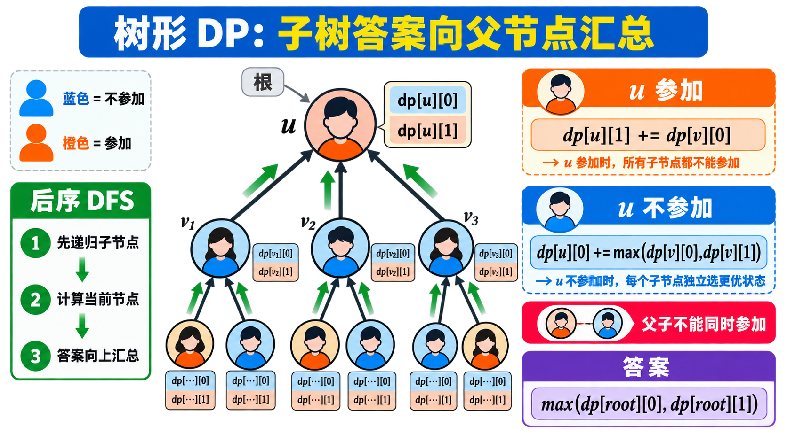

### 10.13 旅行商（状态压缩 DP）

```cpp
int tsp(vector<vector<int>>& dist) {
    int n = dist.size();
    vector<vector<int>> dp(1 << n, vector<int>(n, INT_MAX));
    dp[1][0] = 0;
    for (int mask = 1; mask < (1 << n); mask++)
        for (int i = 0; i < n; i++)
            if (dp[mask][i] < INT_MAX)
                for (int j = 0; j < n; j++)
                    if (!(mask & (1 << j)))
                        dp[mask | (1 << j)][j] = min(dp[mask | (1 << j)][j],
                                                     dp[mask][i] + dist[i][j]);
    int ans = INT_MAX;
    for (int i = 1; i < n; i++)
        ans = min(ans, dp[(1<<n)-1][i] + dist[i][0]);
    return ans;
}
```

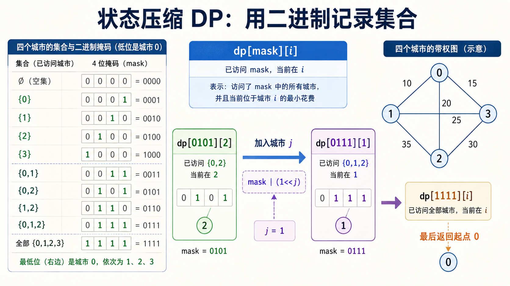

### 10.14 数位 DP

```cpp
// 统计 [0, n] 中某数字出现的次数
int dfs(int pos, int cnt, bool limit, bool lead) {
    if (pos == 0) return cnt;
    if (!limit && !lead && memo[pos][cnt] != -1) return memo[pos][cnt];
    int up = limit ? digits[pos] : 9;
    int ans = 0;
    for (int i = 0; i <= up; i++) {
        bool newLead = lead && i == 0;
        int newCnt = cnt + (!newLead && i == target);
        ans += dfs(pos - 1, newCnt, limit && i == up, newLead);
    }
    if (!limit && !lead) memo[pos][cnt] = ans;
    return ans;
}
```

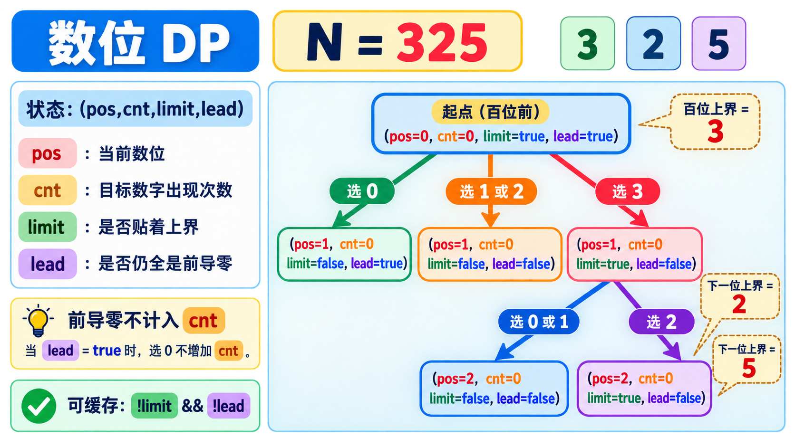

### 10.15 记忆化搜索

```cpp
// 从 DFS 到 DP 的过渡
vector<vector<int>> memo;
int dfs(int i, int j) {
    if (i < 0 || j < 0) return 0;
    if (memo[i][j] != -1) return memo[i][j];
    return memo[i][j] = max(dfs(i-1, j), dfs(i, j-1)) + grid[i][j];
}
```

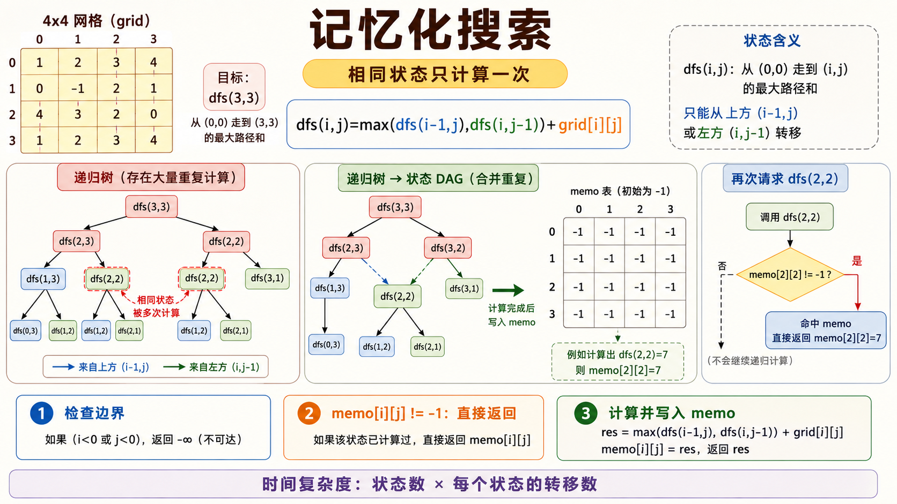

---

## 十一、字符串算法

### 11.1 KMP（求 next 数组）

```cpp
vector<int> getNext(string& p) {
    int m = p.size();
    vector<int> nxt(m, 0);
    for (int i = 1, j = 0; i < m; i++) {
        while (j > 0 && p[i] != p[j]) j = nxt[j - 1];
        if (p[i] == p[j]) j++;
        nxt[i] = j;
    }
    return nxt;
}
```

### 11.2 KMP 匹配

```cpp
int kmp(string& s, string& p) {
    auto nxt = getNext(p);
    int n = s.size(), m = p.size();
    for (int i = 0, j = 0; i < n; i++) {
        while (j > 0 && s[i] != p[j]) j = nxt[j - 1];
        if (s[i] == p[j]) j++;
        if (j == m) return i - m + 1;  // 匹配成功
    }
    return -1;
}
```

### 11.3 中心扩展判断回文串

```cpp
string expand(string& s, int l, int r) {
    while (l >= 0 && r < s.size() && s[l] == s[r]) { l--; r++; }
    return s.substr(l + 1, r - l - 1);
}
```

### 11.4 DP 判断回文

```cpp
vector<vector<bool>> isPalindrome(string& s) {
    int n = s.size();
    vector<vector<bool>> dp(n, vector<bool>(n, false));
    for (int i = n - 1; i >= 0; i--)
        for (int j = i; j < n; j++)
            dp[i][j] = (s[i] == s[j]) && (j - i <= 2 || dp[i+1][j-1]);
    return dp;
}
```

---

## 十二、数学、数论与位运算

### 12.1 质数判断

```cpp
bool isPrime(int n) {
    if (n < 2) return false;
    for (int i = 2; i * i <= n; i++)
        if (n % i == 0) return false;
    return true;
}
```

### 12.2 埃氏筛

```cpp
vector<int> sieve(int n) {
    vector<bool> is_prime(n + 1, true);
    is_prime[0] = is_prime[1] = false;
    vector<int> primes;
    for (int i = 2; i <= n; i++) {
        if (is_prime[i]) {
            primes.push_back(i);
            for (int j = i * 2; j <= n; j += i)
                is_prime[j] = false;
        }
    }
    return primes;
}
```

### 12.3 线性筛

```cpp
vector<int> linearSieve(int n) {
    vector<bool> is_composite(n + 1, false);
    vector<int> primes;
    for (int i = 2; i <= n; i++) {
        if (!is_composite[i]) primes.push_back(i);
        for (int p : primes) {
            if (i * p > n) break;
            is_composite[i * p] = true;
            if (i % p == 0) break;
        }
    }
    return primes;
}
```

### 12.4 最大公约数

```cpp
int gcd(int a, int b) { return b == 0 ? a : gcd(b, a % b); }
```

### 12.5 最小公倍数

```cpp
int lcm(int a, int b) { return a / gcd(a, b) * b; }
```

### 12.6 求所有约数

```cpp
vector<int> getDivisors(int n) {
    vector<int> res;
    for (int i = 1; i * i <= n; i++)
        if (n % i == 0) {
            res.push_back(i);
            if (i * i != n) res.push_back(n / i);
        }
    return res;
}
```

### 12.7 欧拉函数（单个）

```cpp
int phi(int n) {
    int ans = n;
    for (int i = 2; i * i <= n; i++) {
        if (n % i == 0) {
            ans = ans / i * (i - 1);
            while (n % i == 0) n /= i;
        }
    }
    if (n > 1) ans = ans / n * (n - 1);
    return ans;
}
```

### 12.8 筛法求 1~n 所有欧拉函数

```cpp
vector<int> eulerSieve(int n) {
    vector<int> phi(n + 1);
    iota(phi.begin(), phi.end(), 0);
    for (int i = 2; i <= n; i++)
        if (phi[i] == i)  // i 是质数
            for (int j = i; j <= n; j += i)
                phi[j] = phi[j] / i * (i - 1);
    return phi;
}
```

### 12.9 快速幂

```cpp
long long qpow(long long a, long long b, long long mod) {
    long long res = 1;
    while (b) {
        if (b & 1) res = res * a % mod;
        a = a * a % mod;
        b >>= 1;
    }
    return res;
}
```

### 12.10 矩阵快速幂

```cpp
typedef vector<vector<long long>> Matrix;
Matrix mul(Matrix& A, Matrix& B, long long mod) {
    int n = A.size();
    Matrix C(n, vector<long long>(n, 0));
    for (int i = 0; i < n; i++)
        for (int k = 0; k < n; k++)
            for (int j = 0; j < n; j++)
                C[i][j] = (C[i][j] + A[i][k] * B[k][j]) % mod;
    return C;
}
Matrix matPow(Matrix A, long long b, long long mod) {
    int n = A.size();
    Matrix res(n, vector<long long>(n, 0));
    for (int i = 0; i < n; i++) res[i][i] = 1;
    while (b) {
        if (b & 1) res = mul(res, A, mod);
        A = mul(A, A, mod);
        b >>= 1;
    }
    return res;
}
```

### 12.11 扩展欧几里得

```cpp
// 求 ax + by = gcd(a,b) 的解
int exgcd(int a, int b, int& x, int& y) {
    if (b == 0) { x = 1; y = 0; return a; }
    int d = exgcd(b, a % b, y, x);
    y -= a / b * x;
    return d;
}
```

### 12.12 模逆元

```cpp
int inv(int a, int m) {
    int x, y;
    int d = exgcd(a, m, x, y);
    if (d != 1) return -1;  // 逆元不存在
    return (x % m + m) % m;
}
```

### 12.13 组合数（预处理阶乘）

```cpp
const int MOD = 1e9 + 7;
long long fact[N], invFact[N];
void init(int n) {
    fact[0] = 1;
    for (int i = 1; i <= n; i++) fact[i] = fact[i-1] * i % MOD;
    invFact[n] = qpow(fact[n], MOD - 2, MOD);
    for (int i = n - 1; i >= 0; i--) invFact[i] = invFact[i+1] * (i+1) % MOD;
}
long long C(int n, int m) {
    if (m < 0 || m > n) return 0;
    return fact[n] * invFact[m] % MOD * invFact[n-m] % MOD;
}
```

### 12.14 容斥原理

```cpp
// 求 [1, n] 中能被集合 A 中至少一个数整除的个数
long long inclusionExclusion(int n, vector<int>& A) {
    long long ans = 0;
    int m = A.size();
    for (int mask = 1; mask < (1 << m); mask++) {
        long long lcm = 1;
        int bits = 0;
        for (int i = 0; i < m; i++)
            if (mask & (1 << i)) {
                bits++;
                lcm = lcm / gcd(lcm, A[i]) * A[i];
                if (lcm > n) break;
            }
        if (bits % 2 == 1) ans += n / lcm;
        else ans -= n / lcm;
    }
    return ans;
}
```

### 12.15 高斯消元

```cpp
vector<double> gauss(vector<vector<double>>& a) {
    int n = a.size();
    for (int i = 0; i < n; i++) {
        int r = i;
        for (int j = i + 1; j < n; j++)
            if (fabs(a[j][i]) > fabs(a[r][i])) r = j;
        swap(a[i], a[r]);
        for (int j = i + 1; j <= n; j++) a[i][j] /= a[i][i];
        a[i][i] = 1;
        for (int k = 0; k < n; k++)
            if (k != i)
                for (int j = i + 1; j <= n; j++)
                    a[k][j] -= a[k][i] * a[i][j];
    }
    vector<double> ans(n);
    for (int i = 0; i < n; i++) ans[i] = a[i][n];
    return ans;
}
```

### 12.16 lowbit

```cpp
int lowbit(int x) { return x & (-x); }
```

### 12.17 统计 1 的个数

```cpp
int popcount(int x) { return __builtin_popcount(x); }
```

### 12.18 子集枚举

```cpp
// 枚举 mask 的所有非空子集
for (int sub = mask; sub; sub = (sub - 1) & mask) { }

// 遍历所有子集
for (int sub = 0; sub < (1 << n); sub++) { }
```

### 12.19 异或性质

```cpp
// a ^ a = 0, a ^ 0 = a
// a ^ b = c → a = b ^ c
```

### 12.20 Nim 游戏

```cpp
bool nim(vector<int>& piles) {
    int xorsum = 0;
    for (int x : piles) xorsum ^= x;
    return xorsum != 0;  // 非零则先手必胜
}
```

### 12.21 SG 函数（Sprague-Grundy）

```cpp
int sg(int x) {
    if (memo[x] != -1) return memo[x];
    unordered_set<int> s;
    for (int y : next_states(x)) s.insert(sg(y));
    int g = 0;
    while (s.count(g)) g++;
    return memo[x] = g;
}
```

---

> **使用建议**：每章先理解算法思想，再结合代码模板记忆关键实现细节。刷题时按"识别题型 → 选择模板 → 调整细节"的流程训练。
