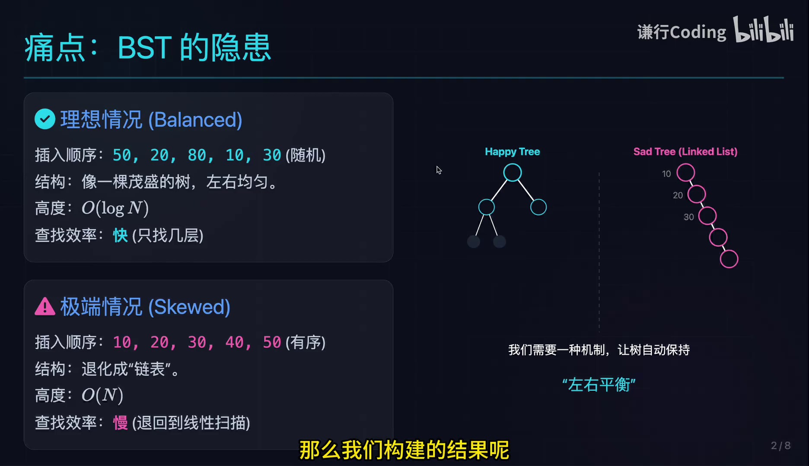
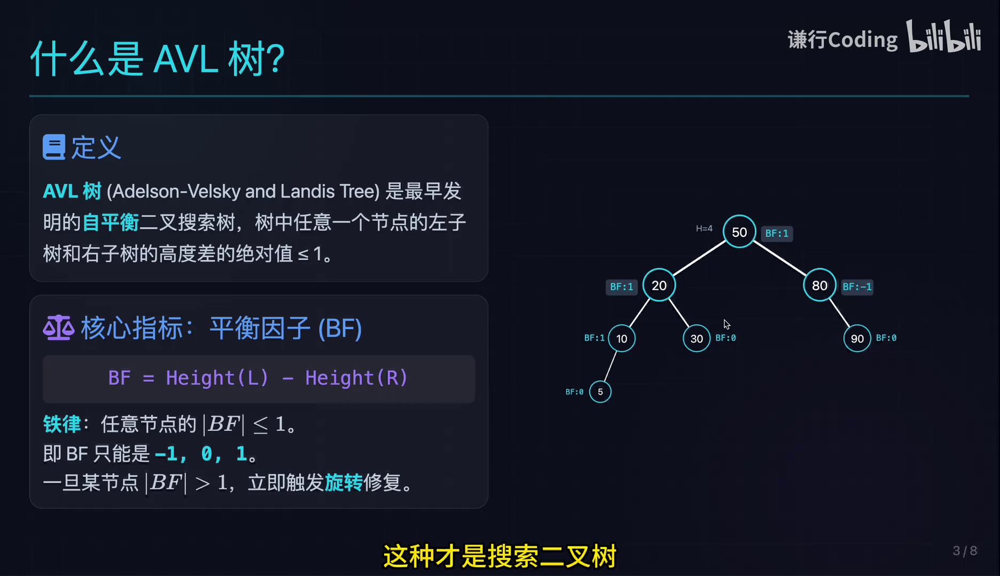
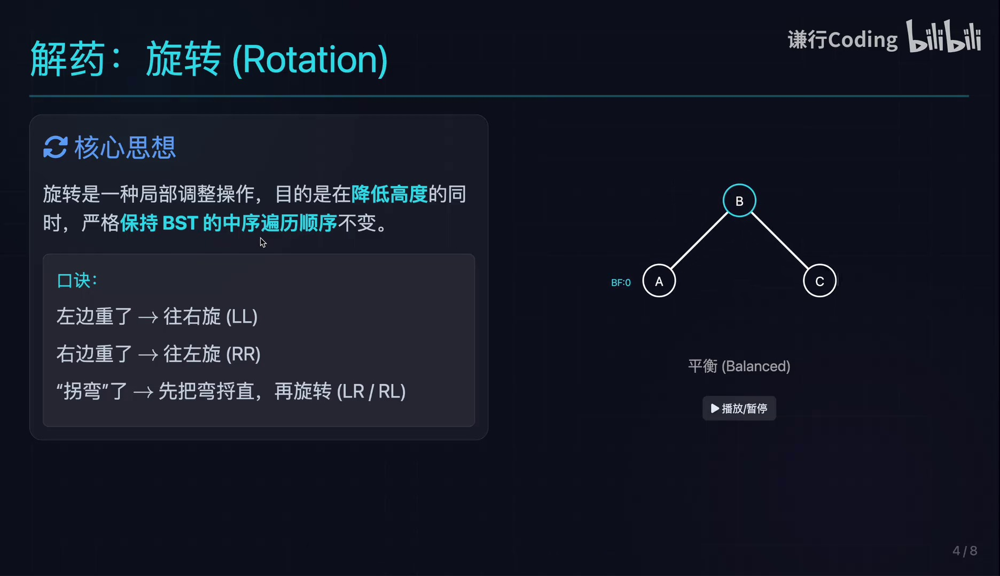
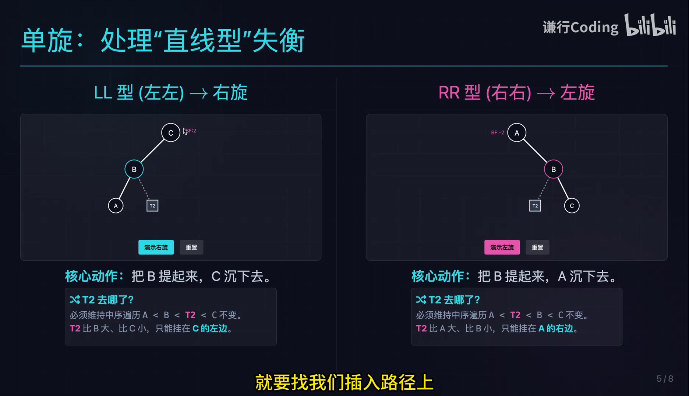
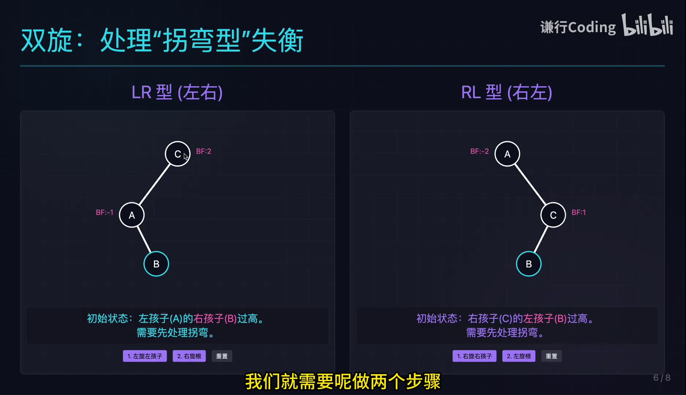
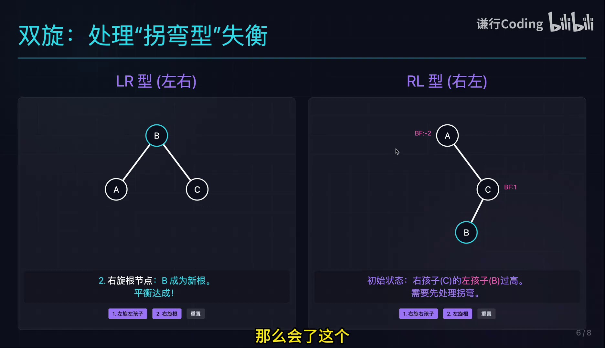
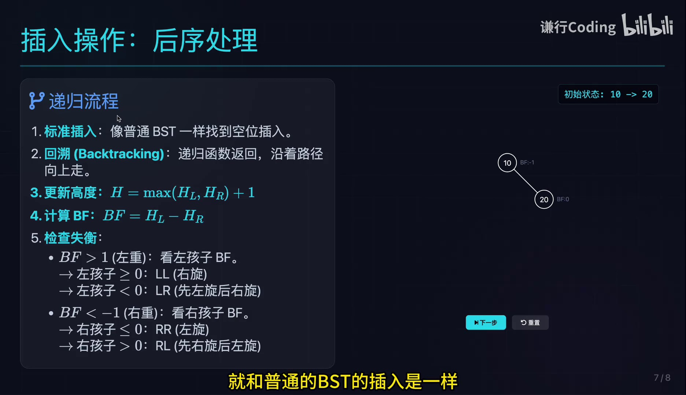

# AVL树：平衡的二叉搜索树


原视频：<https://www.bilibili.com/video/BV1exk4BBE1Y/>

# 导读：为什么普通 BST 需要“自平衡”

## 从搜索效率说起

二叉搜索树（Binary Search Tree，BST）的基本约束是：对任意节点，左子树中的键值更小，右子树中的键值更大。若树形比较均匀，从根向下查找时每一步都能排除一大部分候选，查找路径长度接近树高，平均效率很好。

问题在于，BST 的形状取决于插入顺序。视频用两组数据做对比：随机顺序如 \(50,20,80,10,30\) 容易形成左右均匀的树；有序顺序如 \(10,20,30,40,50\) 则会不断向同一侧延伸，最终退化成类似链表的结构。



*视频画面时间区间：00:00:20--00:00:46。*

> **面试要点**
>
> BST 的“每次比较都能缩小搜索范围”只有在树高较小的时候才真正有价值。均匀树的高度约为 \(O(\log N)\)，退化链的高度却可能达到 \(O(N)\)。AVL 树要解决的就是后者。

## AVL 树的目标

AVL 树以两位发明者 Adelson-Velsky 和 Landis 命名，是最早提出的自平衡二叉搜索树之一。它保留 BST 的有序性，同时给每个节点增加一个局部约束：左右子树高度不能相差太多。

这里的“平衡”不是要求左右节点数完全相同，而是限制高度差。插入后若某条路径让高度差超出允许范围，就通过旋转调整局部结构。这样做的核心收益是：树高始终保持对数级，搜索不会因输入顺序极端而退化。

## 本章小结

- 普通 BST 的最坏情况来自有序输入，树可能退化为链表。
- 树高决定搜索路径长度；均匀树接近 \(O(\log N)\)，退化树接近 \(O(N)\)。
- AVL 树在 BST 的基础上增加自动平衡机制，以局部旋转换取稳定的全局高度。

# AVL 定义与平衡因子

## AVL 的两个必要条件

一棵树要称为 AVL 树，首先必须是 BST：中序遍历得到严格递增（或按约定处理重复键）的序列。其次，对树中每个节点，都要满足左右子树高度差的绝对值不超过 1。

视频中给出的定义画面还展示了一个具体例子：根节点 50 的左子树高度略高于右子树，但差值仍在允许范围内。



*视频画面时间区间：00:01:00--00:01:35。*

## 平衡因子的计算

平衡因子（Balance Factor，简称 BF）把“是否失衡”变成一个可计算的数。对节点 \(v\)，视频采用的定义为

$$
\mathrm{BF}(v)=H_L-H_R.
$$

其中：
- \(H_L\)：节点 \(v\) 左子树的高度；
- \(H_R\)：节点 \(v\) 右子树的高度；
- \(\mathrm{BF}(v)\)：节点 \(v\) 的平衡因子。

AVL 的局部不变量可以写成

$$
\left|\mathrm{BF}(v)\right|\leq 1,  对所有节点 v.
$$

因此，正常节点的 BF 只能是 \(-1,0,1\)。当某个节点出现 \(\mathrm{BF}=2\) 或 \(\mathrm{BF}=-2\) 时，它就是失衡点，需要旋转修复。

> **关键概念**
>
> BF 的符号也提供方向信息：\(\mathrm{BF}>0\) 表示左子树更高，即“左重”；\(\mathrm{BF}<0\) 表示右子树更高，即“右重”。后续 LL、RR、LR、RL 的判断，实质上是在追踪失衡方向的组合。

## 为什么插入后要回溯

AVL 插入的第一步和普通 BST 一样：沿比较结果向下找到空位置，把新键作为叶子插入。变化从插入完成后开始：新叶子可能增加祖先节点某一侧的高度，所以必须沿插入路径向上回溯，重新计算高度与 BF。

常用高度更新公式为

$$
H(v)=\max\bigl(H_L,H_R\bigr)+1.
$$

其中 \(H(v)\) 是节点 \(v\) 的高度，\(H_L,H_R\) 分别是左右子树高度。更新高度后再计算 BF，若发现绝对值大于 1，就在合适位置进行旋转。

## 本章小结

- AVL = BST 有序性 + 每个节点 \(\lvert\mathrm{BF}\rvert\leq 1\)。
- BF 采用“左高减右高”，正负号分别表示左重、右重。
- 插入后必须沿路径回溯，更新高度、计算 BF，并在第一个失衡点修复。

# 旋转的核心原则：降高度但不破坏顺序

## 旋转究竟要同时完成什么

旋转是局部重连，不是重新构造整棵树。它必须同时满足两个目标：
- 降低或重新分配失衡局部的高度，使 BF 回到允许范围；
- 保持 BST 的中序遍历序列不变，从而保留键值有序性。

视频使用 \(A,B,C\) 表示三个关键节点，并用 \(T_2\) 表示中间子树。旋转时节点会上下移动，但 \(T_2\) 不能随意丢失：它要挂到满足键值大小关系的位置。



*视频画面时间区间：00:02:40--00:03:05。*

以左重的 LL 型为例，假设 \(A<B<T_2<C\)。旋转后仍必须得到中序序列

$$
A,\;B,\;T_2,\;C.
$$

因此，\(T_2\) 既比 \(B\) 大，又比 \(C\) 小，只能挂在 \(C\) 的左侧。这个“按键值区间放回子树”的原则比死记指针操作更可靠。

> **面试要点**
>
> 面试或手算旋转时，先写出旋转前的中序序列，再检查旋转后的中序序列是否完全一致。只要顺序变了，就说明子树挂接位置错了，即使图形看起来“平衡”也不是合法 BST。

## 本章小结

- 旋转的本质是局部重连，目标是恢复高度约束。
- 旋转前后中序遍历必须不变，这是判断正确性的第一原则。
- \(T_2\) 等中间子树不能丢失，要依据键值区间重新挂接。

# 单旋转：LL 与 RR

## LL 型：右旋

LL 型表示失衡发生在左子树的左侧：插入路径连续向左延伸，失衡节点左重，且其左孩子也是左重或不右重。修复方法是围绕失衡节点做一次右旋，把左孩子 \(B\) 提到上方，把原根 \(C\) 下沉到右侧。



*视频画面时间区间：00:04:10--00:04:45。*

对 LL 右旋，可以把结构抽象为

$$
{c}
C\\[-1mm]
/ \backslash\\[-1mm]
B  T_3\\[-1mm]
/ \backslash\\[-1mm]
A  T_2

 \Longrightarrow 
{c}
B\\[-1mm]
/ \backslash\\[-1mm]
A  C\\[-1mm]
  / \backslash\\[-1mm]
  T_2  T_3.

$$

这里 \(A<T_2<B<C<T_3\) 的具体区间关系依赖画法，但原则始终是：\(T_2\) 位于 \(B\) 与 \(C\) 之间，所以应成为 \(C\) 的左子树。

## RR 型：左旋

RR 型是 LL 的镜像：失衡发生在右子树的右侧，失衡节点右重，其右孩子也向右延伸。修复方法是一次左旋，让中间节点上升，原根下沉到左侧。

可以用一句方向口诀辅助记忆：
- 左边太重、直线向左（LL）\(\rightarrow\) 右旋；
- 右边太重、直线向右（RR）\(\rightarrow\) 左旋。

这里的“旋转方向”指围绕失衡根的操作方向，而不是失衡发生在哪一侧。正因为二者相反，初学者很容易把 LL 和右旋记反。

> **容易混淆**
>
> 不要只看“左重/右重”就立即旋转。还要看失衡点的孩子向哪边重：直线型是单旋，折线型则是双旋。并且在代码中，旋转后要更新受影响节点的高度。

## 本章小结

- LL 是左左直线型，执行一次右旋。
- RR 是右右直线型，执行一次左旋。
- 单旋的判断依赖“失衡点方向 + 子树延伸方向”，不能只看一个 BF。

# 双旋转：LR 与 RL

## 为什么折线型需要两步

当失衡路径呈折线时，一次旋转无法把中间节点直接提到正确位置。例如 LR 型中，失衡点左重，但左孩子的右子树更高。此时先对左孩子做左旋，把折线“掰直”，再对失衡根做右旋。

RL 型对称处理：先对右孩子做右旋，再对失衡根做左旋。



*视频画面时间区间：00:08:40--00:09:20。*

## LR：先左旋孩子，再右旋根

设失衡根为 \(C\)，其左孩子为 \(A\)，而 \(A\) 的右孩子为 \(B\)。结构是

$$
C\leftarrow A\rightarrow B.
$$

修复过程分两步：
- 对 \(A\) 做左旋，让 \(B\) 上升，形成以 \(B\) 为根的 LL 型；
- 对 \(C\) 做右旋，让 \(B\) 再上升到局部根。

最终局部结构通常是 \(B\) 为根，\(A\) 为左子树，\(C\) 为右子树；中间的子树仍按键值区间挂接。

## RL：先右旋孩子，再左旋根

RL 型与 LR 型镜像。设失衡根 \(A\) 的右孩子为 \(C\)，而 \(C\) 的左孩子为 \(B\)，先围绕 \(C\) 做右旋，把 \(B\) 提上来，再围绕 \(A\) 做左旋。



*视频画面时间区间：00:09:45--00:10:25。*

> **面试要点**
>
> 四种情况可以压缩成两类本质：直线型（LL、RR）做一次单旋；折线型（LR、RL）先旋子节点把它变直，再旋失衡根。真正应当记住的是“先把弯掰直，再做对应单旋”。

## 本章小结

- LR：左孩子先左旋，失衡根再右旋。
- RL：右孩子先右旋，失衡根再左旋。
- 双旋的第一步不是最终修复，而是把折线变成直线。

# 插入操作：从普通 BST 插入到回溯修复

## 五步插入流程

AVL 插入不是另写一套比较规则，而是复用 BST 的查找路径。视频给出的流程可以整理为：
- **标准插入：**按 BST 规则找到空位，插入新叶子；
- **回溯：**递归返回或沿父指针向上走；
- **更新高度：**使用 \(H=\max(H_L,H_R)+1\)；
- **计算 BF：**使用 \(\mathrm{BF}=H_L-H_R\)；
- **检查失衡：**根据 BF 和子节点 BF 判断 LL、RR、LR 或 RL，并旋转。



*视频画面时间区间：00:13:10--00:13:45。*

## 例子：插入 30

视频用一个较小的树演示插入 30。先按普通 BST 规则比较：30 大于根节点 10，也大于右侧节点 20，于是把 30 插入 20 的右侧。此时局部树形成右右直线型，回溯计算高度后发现失衡。

由于是 RR 型，应对失衡点做左旋。旋转后节点 20 上升，10 下沉到左侧，30 保持在右侧。检查中序遍历，旋转前后都是

$$
10,\;20,\;30.
$$

因此新树既恢复了平衡，也保留了 BST 的有序性。

## 实现时应维护什么

一个可实现的 AVL 节点通常至少保存：
- 键值或比较对象；
- 左、右子指针；
- 节点高度（或者等价的平衡信息）。

旋转函数需要返回新的局部根，因为旋转可能改变子树根，甚至改变整棵树的根。实际代码中常见的逻辑是：先递归插入，再更新当前节点高度，随后检查 BF；若失衡则调用相应旋转函数并返回新的根。

**代码：AVL 插入的伪代码骨架**

```python
def insert(node, key):
    if node is None:
        return Node(key)

    if key < node.key:
        node.left = insert(node.left, key)
    elif key > node.key:
        node.right = insert(node.right, key)
    else:
        return node                    # 按约定处理重复键

    node.height = max(height(node.left),
                      height(node.right)) + 1
    bf = height(node.left) - height(node.right)

    if bf > 1 and key < node.left.key:  # LL
        return rotate_right(node)
    if bf < -1 and key > node.right.key: # RR
        return rotate_left(node)
    if bf > 1 and key > node.left.key: # LR
        node.left = rotate_left(node.left)
        return rotate_right(node)
    if bf < -1 and key < node.right.key: # RL
        node.right = rotate_right(node.right)
        return rotate_left(node)

    return node
```

这段伪代码把视频的“标准插入—回溯—更新—判断—旋转”串成了一个递归过程。生产实现还需明确空子树高度、重复键策略、删除操作以及旋转后的高度更新顺序。

## 本章小结

- AVL 插入前半段与 BST 相同，差异集中在回溯修复。
- 回溯阶段必须先更新高度，再计算 BF，再选择旋转。
- 旋转函数要返回新的子树根；中序顺序和节点高度是两项核心检查。

# 复杂度、适用场景与红黑树对比

## AVL 的性能与代价

AVL 的严格平衡约束保证树高为对数级，因此查找、插入和删除在渐进意义上都能保持 \(O(\log N)\) 的上界。这里的 \(N\) 表示树中节点数量，\(O(\log N)\) 表示操作路径随数据规模增长得较慢。

但“严格平衡”并不是免费得到的。每次插入或删除都可能触发回溯、更新高度和旋转；节点还要额外保存高度信息。于是 AVL 更适合查询多、写入相对少的场景：多花一点维护成本，换取非常稳定的查询路径。

## 为什么工程中常见红黑树

视频结尾把 AVL 与红黑树（Red-Black Tree）做了对照。AVL 对高度差更较真，倾向于保持严格平衡；红黑树允许一定程度的不完全平衡，以减少插入和删除时的维护代价。

这不是“谁绝对更快”的问题，而是工作负载的选择：
- 读多写少、希望查找路径尽可能短：AVL 的严格平衡更有吸引力；
- 读写都频繁、希望更新操作更轻：红黑树常常更实用；
- 工程实践中，`Map`、`Set` 以及操作系统内核等场景经常采用红黑树或其变体。


*视频画面时间区间：00:14:40--00:15:20。*

> **容易混淆**
>
> 复杂度写成 \(O(\log N)\) 不代表所有常数都相同。AVL 的旋转和高度维护会增加更新常数；红黑树也不是“永远更快”，而是在平衡严格程度与更新成本之间做了不同取舍。

## 本章小结

- AVL 的核心优势是严格平衡和稳定的对数级查找。
- 其代价是插入、删除维护更频繁，实现也更复杂。
- 红黑树以略松的平衡约束换取更低的更新维护成本，适合许多通用工程容器。

# 总结与延伸

## 视频结尾的实质性结论

视频最后强调，AVL 树本质上仍是一种特殊的 BST：它没有改变比较和中序有序的基础，只是在插入、删除后增加了平衡修复。AVL 适合读操作较多的场景，但严格保持平衡需要频繁旋转、额外存储高度，实现复杂度也更高。对于读写都多的场景，可以进一步学习红黑树，理解“允许少量不平衡以降低更新代价”的设计思路。

## 一张面试速答卡

> **面试要点**
>
> **问：AVL 树是什么？**\\
> 答：AVL 树是带有严格高度平衡约束的二叉搜索树。对任意节点，左右子树高度差的绝对值不超过 1，通常用 \(\mathrm{BF}=H_L-H_R\) 表示平衡因子。插入或删除后沿路径回溯，若 \(\lvert\mathrm{BF}\rvert>1\)，按 LL、RR、LR、RL 进行单旋或双旋修复，同时保证中序遍历顺序不变。它查找稳定在 \(O(\log N)\)，代价是更新维护较重；红黑树则放松平衡约束以改善更新性能。

## 把四种旋转压缩成一个判断框架

实际做题时，可以按以下顺序操作：
- 找到从新节点回溯时遇到的第一个失衡点；
- 看失衡点是左重还是右重；
- 再看较高子树是向外延伸还是向内拐弯；
- 直线型做一次反方向旋转，折线型先旋孩子再旋失衡点；
- 检查所有受影响节点的高度，并核对中序遍历是否保持不变。

这样记忆的重点就从四个孤立的口诀，变成了“方向判定 + 结构变直 + 中序校验”的统一过程。

## 进一步思考

AVL 与红黑树的对比可以推广到很多数据结构设计：更强的不变量通常带来更稳定的查询或更容易证明的性质，但也会提高维护成本；更宽松的不变量则可能让更新更便宜，却需要接受一定的结构波动。学习 AVL 时，真正值得迁移的能力是识别不变量、定位破坏不变量的位置，并设计局部修复使全局性质恢复。
