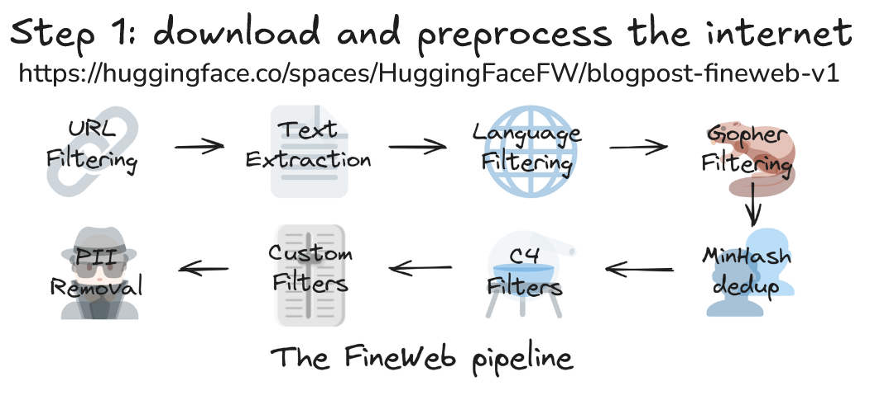
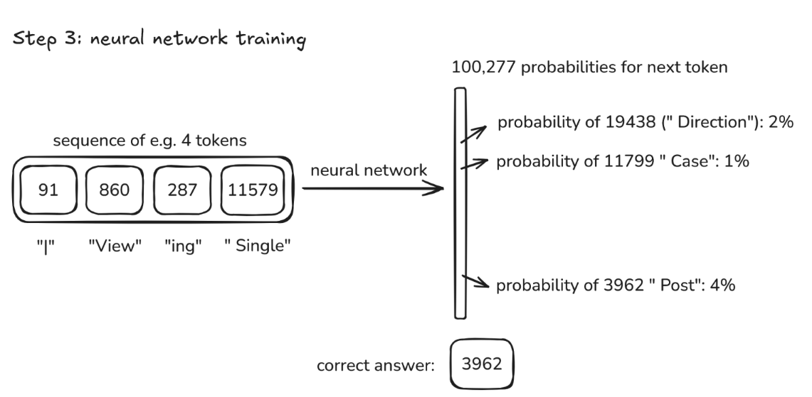

# 《深入探索像chatgpt这样的大语言模型》基于transformer的语言模型的综述

## Step 1：预训练阶段

### 1. 预训练数据集

这个阶段训练得到的模型一般称为基础模型（base model），还不能作为AI助手，可以理解成互联网知识的模拟器或者有损压缩库，因为一般都是在从互联网爬取得到的大量数据集上训练得到，首先需要收集大量的互联网文本数据。

这涉及多个步骤: 

1.下载数据，例如利用Common Crawl提供的27亿网页数据；

 2.数据过滤，包括URL过滤(去除恶意、垃圾等网站)、文本提取(从HTML中提取文本)、语言过滤(例如只保留英语文本)以及个人身份信息移除等；

 3.最终得到一个经过清洗的高质量数据集(例如Hugging Face的FineWeb数据集，这是一个公益组织的网站，一直在，约44TB)。 这些文本数据随后被用于训练神经网络，使其学习文本模式，从而构建LLM模型。

FineWeb数据集包含15万亿 token，占据44TB存储空间；当然，对于预训练LLM来说，这样的数据集规模并不算很大，不过好在是可以公开下载，并且已经进行了清洗、过滤之后的高质量文本数据。

### 2. Tokenization

为了将文本输入神经网络，需要将其转换为神经网络可以处理的一维符号序列。最初的文本表示是二进制序列(0和1)，但序列过长；为了压缩，可以将多个比特组合成字节(256种可能)，进一步可以使用字节对编码算法(Byte Pair Encoding)，将常见的字节对合并成新的符号，从而减少序列长度，增加词汇量。

这个将文本转换为符号的过程称为分词 (tokenization)，即将文本转换为词元（token，有的地方翻译成令牌、标记）序列，这在之前的视频中也用代码进行过演示。 比如"I am laygin，welcome!"，使用gpt-4o的tokenizer就切分成7个tokens，每个token对应的ID是"40， 939， 15634， 11611， 49598， 10927， 0"，我们可以在Tiktokenizer这个网站上测试一下其他的tokenizer，不同的tokenizer划分的结果不同。

那么一段文本是如何划分成一个个token的呢？通常情况，一个英文字母用一个字节就可以表示，一个字节8位，用uint8表示，其值从0到255，也就是词典大小为256，但是我们可以看到gpt-4的词典大小为100277，而上面那个例子，有的 token ID 远远大于255（token ID就是将词典里的token映射到整数，便于模型处理，不同token其ID不同），这就要用到BPE算法，Byte Pair Encoding（BPE） 是一种子词（subword）分割算法，常用于自然语言处理（NLP）中的文本压缩和词汇表构建，它的核心思想是逐步合并最常见的字符或子词对，以减少词汇表的大小，同时提高模型对未知词汇的处理能力。 下面举一个例子来详细了解BPE算法的工作原理。

### BPE 示例：BPE 的工作原理

1. 统计最常见的字符或子词对
2. 合并这些最常见的子词对
3. 重复以上步骤，直到达到设定的词典大小。

#### 1. 初始数据

假设我们有以下单词数据集：**low， lowest， newer， newest**

我们先把它们拆成字符（加上 `▁` 代表空格，表示单词的开头）： ▁l o w ▁l o w e s t ▁n e w e r ▁n e w e s t

#### 2. 统计字符对频率

**('l'， 'o') -> 2 次**
**('o'， 'w') -> 2 次**
**('e'， 'w') -> 2 次**
**('e'， 's') -> 2 次**
**('e'， 'r') -> 1 次**
**('s'， 't') -> 2 次**

最常见的是 **(l， o)** 和 **(o， w)**，我们先合并 `(l， o)`。

#### 3. 合并最常见的字符对

**▁lo w**
**▁lo w e s t**
**▁n e w e r**
**▁n e w e s t**

然后继续找最常见的字符对，比如 `(o， w)`，合并： ▁low▁low e s t▁n e w e r▁n e w e s t 依此类推，我们会得到更大的子词单元，比如 `lowest`， `new`， `newest` 等。

### 3. 模型训练

我们已经下载了大规模数据，也将文本转换成token序列（为了简便，下面所说的token其实是对应的token ID），映射到整数，训练过程就是预测下一个token概率分布（输出层softmax），设置window size，即当前模型能看到的token序列长度。

作者给的例子就是4，基于当前模型能够看到的4个token，预测接下来出现的token，模型的输出就是100277个概率值（因为我们的词典大小是100277），如果我们的数据集里面下一个正确token是3962，那么我们就希望模型预测3962的概率尽可能大，如此就可以计算损失值，然后反向传播计算梯度，然后更新模型参数，这就是训练的过程，也就是模型学习的过程。 有朋友可能不理解为什么下一个正确token是3962，这是根据我们数据集确定的，以上面"I am laygin，welcome!"这段文本为例，比如模型看到"40， 939， 15634， 11611"，需要预测下一个token，正确值应该是49598。

### 4. 模型推理

神经网络训练完成后，接下来是推理阶段，推理过程是从模型中生成新数据，本质上是根据模型内化在参数中的模式进行预测。

它通过输入一些起始token(例如“91”)，模型会输出一个概率向量，表示每个后续token出现的概率。然后，模型通过从该概率分布中采样来选择下一个token(例如“860”)。这个过程不断重复，每次都将新生成的token添加到序列中，再根据新的序列预测下一个token。由于每次采样都是随机的，所以生成的序列虽然在统计特性上与训练数据相似，但不会完全相同，而是训练数据的“重混”(remix)。ChatGPT等大型语言模型的工作原理就是如此：模型在训练完成后参数固定，用户输入的文本作为起始token，模型通过推理生成后续文本，整个过程没有额外的训练。 模型的推理阶段就是最终用户接触最多的了，比如ChatGPT的聊天窗口、deepseek的聊天窗口等等，此时的模型已经训练好了（当然，不会是base版本，是后面SFT或者RL之后的版本，但其原理差不多）。当我们在对话框输入问题的时候，我们输入的文本会进行tokenize操作，转换为token序列，模型基于这些token序列预测下一个token，然后再将预测得到的token加入原始token序列，继续预测下一个token，依次循环，直到遇到结束标记。因为是概率采样，我们即使多次输入同样的问题，得到的结果也不会完全一样。强烈推荐看看之前文章中关于LLM数据集、tokenizer的视频片段，有实操。

## Step 2：监督微调阶段

### 1. 对话数据集

通过预训练得到的基础模型本质上是文本模拟器，本身并非直接可用，需要进一步处理才能成为可交互的助手。

监督微调阶段使用的数据集与预训练使用的数据集有所不同，本阶段需要通过训练对话数据集来实现与人类进行多轮对话交互。 利用人工标注员创建大量包含人类提问和理想助手回复的对话数据集，然后用这些数据对预训练的语言模型进行微调，这个过程本质上是通过示例，让模型学习如何像人类助手一样进行回复，包括提供帮助、说实话和拒绝不当请求。与LLM的对话并非与某种神奇的AI进行交互，而是与对人类标注员（通常是专业人士）行为的统计模拟进行交互，模型的回复基于其预训练知识和对话数据集中的统计模式。

### 2. 幻觉

另外，幻觉（Hallucinations）是需要关注的一个重要问题，有时候模型的回答非常肯定、非常自信，但却是LLM胡编乱造的，这源于训练数据中，人类对问题的回答都自信满满，即使是基于网络搜索的结果。

因此，当模型遇到未知问题时，它不会说“不知道”，而是模仿训练数据中自信的回答风格，从而编造答案。 为了解决这个问题，研究人员采用了两种方法：**第一，**通过探测模型的知识边界，在训练数据中加入模型“不知道”的例子，让模型学会在不确定时表达不确定性。**第二，**为模型引入工具，例如网络搜索，允许模型在需要时搜索信息，并将搜索结果添加到上下文窗口中，相当于刷新模型的“工作记忆”，从而提高回答的准确性。模型的知识储存在参数中，类似于长时记忆；上下文窗口则类似于工作记忆，直接影响模型的输出。因此，在使用LLM时，提供相关文本信息能显著提高模型的输出质量。 大型语言模型（LLM）如ChatGPT并没有真正的自我意识。当被问及“你是谁？谁创造了你？”这类问题时，它们的回答往往是基于训练数据中统计规律的推测，而非真实的自我认知。例如，Falcon模型可能会声称自己由OpenAI基于GPT-3模型构建，但这很可能是因为训练数据中包含大量关于OpenAI和ChatGPT的信息，模型只是“幻觉”出了这个身份。开发者可以通过两种方式人为地赋予LLM“自我认知”：一是像Allen AI的Theo模型那样，在微调数据中加入大量预设的“自我介绍”对话；二是通过系统消息在对话开始时向模型“灌输”其身份信息。这些方法本质上都是人为设定，并非LLM真正具备的自我意识。 LLM在解决问题时，其计算能力受限于其逐个token处理的机制。每个token的计算量有限，因此复杂的计算需要分解成多个步骤，分布在多个token上完成。直接要求模型在一个token中给出复杂问题的答案(例如复杂的数学题)，会超出其计算能力，导致错误。更好的方法是引导模型逐步计算（**let's think it step by step**），给出中间结果，将计算过程分解成多个简单的步骤，从而提高准确性。此外，模型在计数等任务上表现不佳，也源于此原因。为了克服这一限制，可以利用模型的工具使用能力，例如调用代码解释器（**use code**），将计算任务交给更可靠的工具完成，避免依赖模型自身的有限计算能力，因此在与LLM交互时，需要合理设计提示，将复杂任务分解成模型能够处理的小任务，并充分利用其工具使用能力。

LLM存在一些认知缺陷，例如在拼写相关的任务上表现不佳。这是因为模型处理的是“token”(文本片段)，而不是单个字符。模型无法像人类一样直接访问和处理单个字符，因此在需要字符级别操作的任务(例如从字符串中提取每第三个字符)上容易出错。 以“ubiquitous”为例，模型将其视为三个token，无法像人类一样轻松地索引到每个第三个字符。另一个著名的例子是计算“strawberry”中“r”的个数，模型曾长期错误地回答为两个，而非正确的三个。

这些问题源于模型对字符的处理方式以及其在计数方面的不足，虽然一些模型现在可能已经通过硬编码或其他方式解决了这些特定问题，但这些例子说明了LLM在使用中需要注意的局限性，为了弥补这些缺陷，可以引导模型使用外部工具(例如Python代码)来完成任务。 LLM虽然能够解决复杂的数学、物理、化学和生物问题，甚至超越人类专家水平，但在一些简单问题上却表现出令人费解的错误。例如，模型在比较9.11和9.9大小的问题上表现不稳定，有时给出错误答案，有时甚至自相矛盾。 因此，LLM虽然强大，但仍存在不可靠性，应谨慎使用，将其视为工具而非绝对可靠的答案来源。

## Step 3：强化学习阶段

预训练阶段利用海量互联网文档训练基础模型，类似于构建一个互联网文档模拟器，耗时且资源密集。 监督微调阶段则使用人工标注的大规模对话数据集进行训练，目标是构建一个能够与人类进行对话的助手模型。 最后，强化学习阶段类似于“学习过程”，通过让模型练习解决问题，并根据最终答案进行反馈调整，进一步提升模型的性能和响应质量，减少幻觉。这三个阶段由不同的团队分别完成，最终形成一个完整的LLM训练流程。

这个过程类似于儿童的学习过程，分三个阶段：**预训练阶段**相当于阅读所有教材，构建知识库；**监督微调(SFT)阶段**模仿人类专家提供的标准解题步骤，但缺乏对模型自身认知的理解；**强化学习(RL)阶段**则让模型自行尝试多种解题方法，通过奖励正确的答案来学习最有效的解题策略，最终发现最适合模型本身的解题步骤，而非依赖人类标注。 RL阶段弥补了SFT阶段的不足，让模型能够更有效地利用自身知识，并避免人类标注中可能存在的偏差。

前两个阶段已经很成熟，而RL微调仍处于早期发展阶段，其细节复杂，需要大量的调参。最近DeepSeek公司公开发表的论文，详细介绍了其RL微调方法，引发了业界对RL在LLM中的应用的关注。 比如DeepSeek在“9.9和9.11哪个更大”问题上的回答（中间思考内容太多，收起来了）：

RL微调能够显著提升模型解决数学问题等复杂任务的能力，其关键在于模型能够自主学习“思维链”(chain of thought)，即逐步推理、尝试不同方法、检查结果等，从而提高准确性，即使答案长度增加也在所不惜。这种“思维”能力是RL训练中涌现出来的特性，并非人工预设。

目前，一些公司如DeepSeek和OpenAI都提供了基于RL训练的“思考型”模型，例如DeepSeek R1和OpenAI的某些GPT-4模型。这些模型在解决需要复杂推理的问题上表现出色，但同时也存在一些限制，例如运行速度较慢，且部分模型需要付费。Google的Gemini也推出了类似的“思考型”模型。总而言之，RL微调是LLM发展的前沿方向，虽然仍处于实验阶段，但其在提升模型推理能力方面的潜力巨大。 强化学习在AI领域并非新事物，AlphaGo战胜人类围棋高手便是例证。通过与自身对弈，AlphaGo的强化学习模型超越了模仿人类专家的监督学习模型，达到了更高的ELO等级。这表明强化学习不受限于人类的表现，能够发现人类未知的策略，例如AlphaGo的“37手”。 类似地，大型语言模型(LLM)的推理能力提升也需要超越单纯模仿专家，通过构建大型、多样化的“游戏环境”(即各种问题)，让模型进行强化学习，从而发现人类无法企及的解决问题方法，甚至可能发展出超越人类的思维方式和新的“语言”。目前LLM研究的前沿正致力于创建这种规模庞大、种类丰富的训练数据集，以推动模型在开放领域实现强化学习的突破。

然而，在不可验证的领域(如创意写作)，直接使用强化学习面临挑战，因为难以自动评估生成的质量。为此，研究者提出了基于人类反馈的强化学习( reinforcement learning from human feedback，RLHF)，通过训练一个奖励模型来模拟人类偏好，从而实现自动评估。RLHF虽然能有效提升模型性能，但其奖励模型容易被“操控”，产生无意义的结果，因此其应用需谨慎，不能无限期地进行。 总而言之，LLM虽然强大，但仍存在局限性，例如幻觉和知识盲点，使用者应将其作为工具，并对最终结果负责。

## 大语言模型未来的发展方向

**大型语言模型(LLM)的未来发展方向包括：**多模态能力(处理文本、音频、图像)，能够执行更长、更复杂的任务(借助agent)，更无缝地集成到各种工具中，以及能够代表用户执行操作。然而，当前模型仍存在局限性，例如无法像人类一样进行持续学习(测试时训练)，尤其是在处理需要极长上下文窗口的多模态、长期任务时，需要新的研究突破。 **为了紧跟大型语言模型(LLM)的最新发展，作者主要依靠三个资源：**一是LM Arena，一个基于人工评估的LLM排行榜，它根据人类对不同模型答案的比较进行排名，DeepSeek等开源模型的出现是其一大亮点；但需要注意的是，该排行榜最近可能存在一些人为操纵的情况，因此结果需谨慎参考。二是AI News Newsletter，内容全面，几乎每天更新，涵盖了LLM领域的最新信息，虽然部分内容由LLM自动生成，但也有大量人工审核和撰写的内容。三是X(推特)，关注你信任的AI领域专家，可以及时获取最新的信息和动态。总而言之，这三个资源结合使用，能有效帮助你了解LLM领域的最新进展。 **大型语言模型(LLM)的获取途径：**取决于模型类型和用途。**大型私有模型**如OpenAI的ChatGPT和Google的Gemini，需访问其官方网站。**开源模型**如DeepSpeed-Chat等，则需通过推理服务提供商，例如Together.ai访问。对于基础模型，Hyperbolic是一个不错的选择，因为它提供Llama 3.1等模型。小型模型可以本地运行，LM Studio是一个可用的应用程序，尽管其用户界面还有改进空间，但允许用户在本地运行经过蒸馏和精度降低的模型，例如Llama 3 2 instruct 1 billion。

## 总结

本视频深入探讨了类似ChatGPT的大型语言模型(LLM)的工作原理。用户的问题首先被分解成token，然后输入到对话协议格式中，模型通过继续追加token来生成回复，这类似于一个token自动补全的过程。模型的训练分为三个阶段:预训练(从互联网获取知识)、监督微调(人类标注员提供高质量对话数据，模型学习模仿他们的回复)和强化学习(部分高级模型使用，提升推理能力)。虽然模型能模拟人类标注员的回复，但它并非真正的人类思维，存在幻觉、能力缺失等问题，类似于“瑞士奶酪模型”，存在漏洞。强化学习虽然能提升模型的推理能力，但仍处于早期阶段，其效果在可验证领域(如数学、代码)比不可验证领域(如创意写作)更显著。总而言之，LLM是一个强大的工具，能极大提高工作效率，但使用者需谨慎使用，并始终核实其输出结果。

## Andrej Introduction

Andrej was a founding member at OpenAI (2015) and then Sr. Director of AI at Tesla (2017-2022), and is now a founder at Eureka Labs, which is building an AI-native school. His goal in this video is to raise knowledge and understanding of the state of the art in AI, and empower people to effectively use the latest and greatest in their work. （Andrej 是 OpenAI 的创始成员之一（2015 年），后来在特斯拉担任AI资深总监（2017-2022 年）。现在，他创办了 Eureka Labs，一家专注于 AI 原生教育的学校。在这段视频里，他希望帮助大家更深入地了解 AI 领域的最新进展，并让更多人学会如何把这些前沿技术应用到自己的工作中。）
