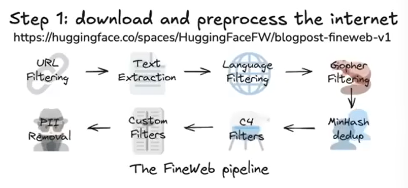
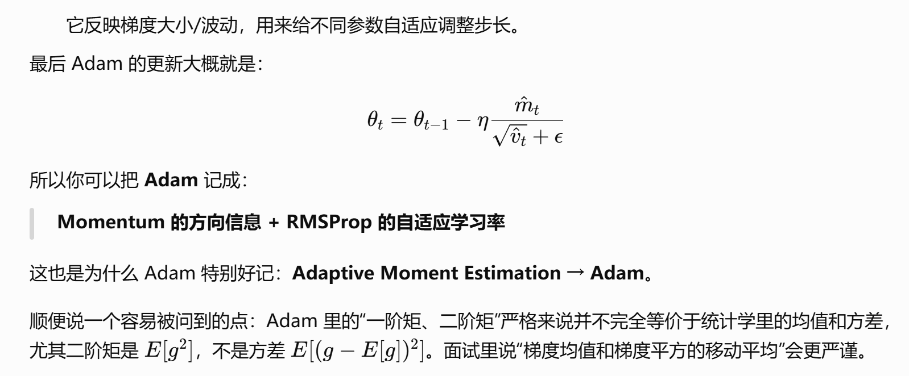

##  一、预训练阶段

#### step1：预训练数据集的获取

这个阶段训练得到的模型一般称为基础模型（base model），还不能作为AI助手，可以理解成互联网知识的模拟器或者有损压缩库，因为一般都是在从互联网爬取得到的大量数据集上训练得到，首先需要收集大量的互联网文本数据。

这涉及多个步骤:  
1.下载数据，例如利用Common Crawl提供的27亿网页数据；  
2.数据过滤，包括URL过滤(去除恶意、垃圾等网站)、文本提取(从HTML中提取文本)、语言过滤(例如只保留英语文本)以及个人身份信息移除等；  
3.最终得到一个经过清洗的高质量数据集(例如Hugging Face的FineWeb数据集，约44TB)。  
这些文本数据随后被用于训练神经网络，使其学习文本模式，从而构建LLM模型。FineWeb数据集包含15万亿 token（至于什么是token，下面会讲到，在之前的LLM微调视频中也有讲到过：大语言模型微调)，占据44TB存储空间；当然，对于预训练LLM来说，这样的数据集规模并不算很大，不过好在是可以公开下载，并且已经进行了清洗、过滤之后的高质量文本数据。

#### step2：tokenizer

为了将文本输入神经网络，需要将其转换为神经网络可以处理的有限的一维符号序列的集合。

第一种做法是utf-8

最初的文本表示是二进制序列(0和1)，但序列过长；为了压缩，可以将多个比特组合成字节(256种可能)，进一步可以使用字节对编码算法(Byte Pair Encoding)，将常见的字节对合并成新的符号，从而减少序列长度，增加词汇量。
